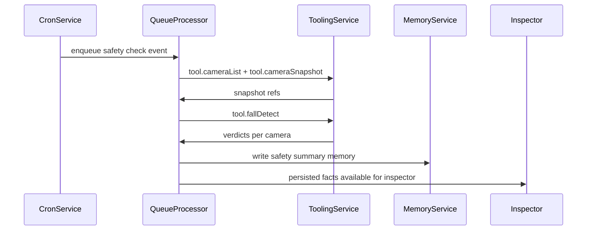
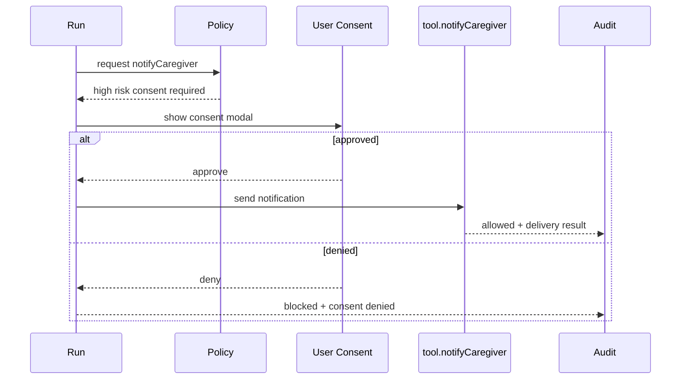
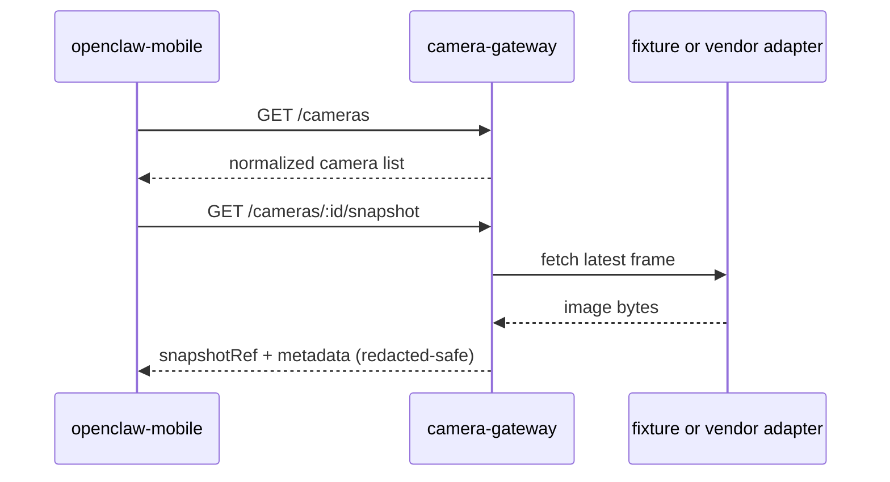

# Flutter OpenClaw demo aged care camera safety

## Purpose

Define a demo focused capability that reuses the existing OpenClaw mobile runtime to run scheduled aged care safety checks from camera snapshots, classify risk, persist explainable outcomes, and optionally escalate to a caregiver with explicit consent.

## Demo narrative and user stories

### Story 1 caregiver setup

- A caregiver opens the mobile workbench and seeds the aged care demo profile.
- The caregiver configures one or more cameras by name, location, and snapshot endpoint mapping.
- The caregiver configures schedule cadence and preferred escalation contact method.

Success looks like:

- camera list is visible and testable
- schedule exists and is enabled
- escalation preferences are visible and editable

### Story 2 periodic safety checks

- On schedule, cron triggers a safety check run.
- The run requests camera snapshots, evaluates each snapshot for fall risk, and produces a consolidated status (`ok`, `fall_suspected`, `uncertain`).
- The run stores explainable artifacts in memory and appears in timeline and inspector.

Success looks like:

- timeline shows safety check events
- inspector shows tool chain and reasoning for each camera
- memory contains summary and provenance links for future runs

### Story 3 escalation path

- If status is `fall_suspected`, the system prepares escalation details.
- `tool.notifyCaregiver` is blocked until high risk runtime consent is granted.
- On approval, notification is sent and audited with redacted payload fragments.

Success looks like:

- user sees clear why notification is requested
- consent decision is auditable
- idempotency prevents duplicate caregiver notifications for the same check

## Architecture proposal

### Camera Gateway concept

Mobile clients are not reliable public ingress points and should not directly integrate with many remote camera vendors in demo mode.

Reasons:

- phones are intermittently online and suspended in background
- direct webhook receive is unreliable on mobile app lifecycle
- camera vendor SDK variance complicates deterministic demos

Proposed demo gateway:

- isolated service (`/openclaw-camera-gateway`) that normalizes camera snapshot fetch
- endpoint surface can be minimal and mockable (`GET /cameras`, `GET /cameras/:id/snapshot`)
- token authenticated, with deterministic fixtures for demo scenarios (`ok`, `fall_test`, `uncertain`)

### Integration points with existing mobile runtime

- cron schedules trigger existing event pipeline
- runtime event payload includes safety check context
- queue processor invokes tool chain through ToolRegistry and ToolingService
- run results persist in existing run tables
- memory service stores summary and provenance
- inspector renders lineage (cron trigger, tool outcomes, memory writes, notification consent/audit)

### Data ownership and storage plan

- camera config: global scope (shared for caregiver profile) with optional per-agent override in future
- last check status: persisted in memory summary entries for explainability and easy inspector surfacing
- caregiver contact prefs: global settings (phone/email/endpoint alias), audited as redacted metadata only

Rationale:

- demo uses one caregiver profile and multiple agents can consume same camera list
- memory already supports provenance and summaries with low schema risk

### Threat and abuse notes

- camera content is sensitive; avoid storing raw image bytes in audit logs
- tool audit must store only redacted references (camera id, checksum, verdict)
- consent is mandatory for `notifyCaregiver` high risk action
- diagnostics export must scrub secrets/tokens and never include raw bearer values
- UI must explain that camera access and caregiver notification are consented actions

## Tool and skill specification (ToolRegistry aligned)

### `tool.cameraList` (low)

- capabilityCategory: `camera`
- requiredPermissions: `camera:list`
- riskLevel: `low`
- input: optional `{ includeDisabled: boolean }`
- output: `{ cameras: [{ cameraId, name, location, status }] }`
- audit redaction: no secrets expected, redact any URL query tokens

### `tool.cameraSnapshot` (medium)

- capabilityCategory: `camera`
- requiredPermissions: `camera:read`
- riskLevel: `medium`
- input: `{ cameraId: string, snapshotMode?: "latest" | "test_fall" | "test_uncertain" }`
- output: `{ cameraId, snapshotRef, capturedAt, checksum, quality }`
- audit redaction: do not include raw image bytes, retain only `snapshotRef` and checksum prefix

### `tool.fallDetect` (medium)

- capabilityCategory: `safety-ml`
- requiredPermissions: `safety:detect`
- riskLevel: `medium`
- input: `{ snapshotRef, cameraId, threshold?: number }`
- output: `{ verdict: "ok" | "fall_suspected" | "uncertain", confidence, reasons[] }`
- audit redaction: keep verdict and confidence, omit any full image payload

### `tool.notifyCaregiver` (high)

- capabilityCategory: `notification`
- requiredPermissions: `notify:caregiver`
- riskLevel: `high`
- input: `{ contactId, severity, summary, checkId, cameraFindings[] }`
- output: `{ deliveryId, channel, acceptedAt }` or blocked outcome
- audit redaction: redact contact details and message body beyond short summary fragment
- consent: required each runtime invocation unless future policy introduces bounded session consent

### Optional helper `tool.safetySummary`

- capabilityCategory: `safety`
- requiredPermissions: `safety:summarize`
- riskLevel: `low`
- purpose: deterministic final summary formatting before memory write and inspector display

## Data model and persistence changes high level

1. camera configuration model
   - preferred: dedicated table in mobile DB for stable CRUD and filtering
   - minimum fields: `camera_id`, `name`, `location`, `gateway_path`, `enabled`, `created_at`, `updated_at`
   - scope: global profile by default

2. safety check result storage
   - use existing run results plus structured memory entries
   - memory entry types:
     - per-run camera finding summary
     - aggregate session safety trend summary
   - optional dedicated `safety_checks` table for dashboard speed can be deferred

3. audit and redaction expectations
   - never store image binary in tool audit rows
   - store snapshot references and checksums only
   - diagnostics export reuses existing scrubber and extends camera specific fields

Migration safety:

- if new table is added, bump schema with additive migration only
- no destructive rename/drop in demo phases

## UX plan

### Demo setup

- add `Seed Aged Care Demo` action
- precreates agent, session, sample cameras, and one enabled cron schedule

### Camera list and config

- simple CRUD list with enable or disable toggle
- test snapshot action per camera (uses `tool.cameraSnapshot`)

### Schedule screen

- reuse existing cron UI
- add preset safety check schedule templates

### Timeline and inspector expectations

- timeline label examples:
  - `Safety Check Run`
  - `Camera Snapshot`
  - `Fall Detection`
  - `Caregiver Notification Requested`
- inspector includes full chain and why panel with ancestry

### Escalation flow

- if `fall_suspected`, render consent modal for caregiver notification
- modal explains:
  - what was detected
  - which cameras contributed
  - what notification will be sent
- decision outcome is logged and visible in inspector tool section

## Demo script Android

1. Start camera gateway locally (fixture mode).
2. Launch app with gateway config:
   - `--dart-define=OPENCLAW_CAMERA_GATEWAY_BASE_URL=http://10.0.2.2:PORT`
   - `--dart-define=OPENCLAW_CAMERA_GATEWAY_TOKEN=demo-token`
3. Tap `Seed Aged Care Demo`.
4. Verify camera list and enabled schedule.
5. Trigger normal run (`ok` fixtures) and inspect timeline + memory summary.
6. Trigger `fall_test` snapshot mode and run schedule again.
7. Approve high risk caregiver notification consent.
8. Open inspector and show:
   - ancestry chain from cron root
   - tool decisions and consent record
   - memory writes and safety summary
   - redacted audit fragments

## Test plan

- deterministic unit tests
  - cron trigger selection for safety check schedule
  - tool policy checks for camera tools and notify consent gate
- integration tests
  - event -> tools -> run result -> memory write -> inspector assembly
- offline tests
  - snapshot tool returns explicit offline fallback and no crash
- idempotency tests
  - duplicate check id does not send duplicate caregiver notification

## Mermaid diagrams

### Cron safety check flow

### Escalation and consent flow

### Gateway interaction

## Phase 2 and beyond milestone breakdown

### Phase 2 milestone A camera gateway stub

- intent: provide a deterministic snapshot source for demo
- scope: isolated `/openclaw-camera-gateway` with fixture camera list and snapshot endpoints
- deliverables: gateway code, README, local run script, API contract doc
- acceptance criteria: mobile can list cameras and fetch snapshot metadata from fixtures
- tests: gateway unit and API tests for auth and fixture responses
- out of scope: vendor specific SDK adapters

### Phase 2 milestone B mobile camera config and tools

- intent: wire camera tools into ToolRegistry and policy system
- scope: add camera tools and camera config UI/storage in mobile app
- deliverables: ToolRegistry entries, ToolingService handlers, camera config screen, migration-safe persistence updates
- acceptance criteria: caregiver can configure cameras and run snapshot test with audit entries
- tests: permission and consent policy tests, tool idempotency tests, DB migration tests
- out of scope: advanced camera health analytics

### Phase 2 milestone C scheduled safety check orchestration

- intent: execute periodic safety checks from cron through tool chain
- scope: cron job payload conventions, snapshot + fall detect orchestration, timeline labels
- deliverables: orchestration service updates, inspector section enhancements, docs update
- acceptance criteria: scheduled run produces verdict and memory summary visible in inspector
- tests: integration path event -> tools -> run result -> memory -> inspector
- out of scope: production ML model integration

### Phase 2 milestone D escalation consent workflow

- intent: safely notify caregiver with explicit high risk approval
- scope: consent modal UX, notify tool execution, audit details, idempotent notification keying
- deliverables: consent UI, notification payload templates, audit and inspector rendering updates
- acceptance criteria: fall suspected flow blocks until approval and records decision reason
- tests: consent approved and denied paths, duplicate suppression tests
- out of scope: multi-recipient escalation trees

### Phase 2 milestone E diagnostics and demo hardening

- intent: make end to end demo repeatable and support troubleshooting
- scope: diagnostics export enrichment for safety run artifacts, seed demo button, runbook polish
- deliverables: export bundle updates, demo script doc, manual QA checklist
- acceptance criteria: Android demo can be run start to finish with explainable outputs and redacted export bundle
- tests: export manifest and redaction tests, offline fallback tests
- out of scope: enterprise security hardening (Milestone 13)
