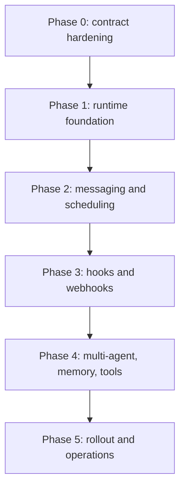

# Flutter OpenClaw Mobile Implementation Readiness and Execution Steps

This document reviews the current milestone requirements (M1 to M12 + relay + interaction maps),
identifies remaining gaps before production implementation, and proposes a concrete build sequence.

## 1) Requirements review status

Current planning coverage is strong across:

- runtime model (routing, queue, retry, dead-letter)
- input sources (human, heartbeat, cron, hooks, webhooks)
- relay delivery model for mobile
- multi-agent handoff model
- memory and tool-permission design
- user interaction maps and Mermaid flows

Conclusion: the existing requirements are sufficient to start implementation, but a few production
requirements should be added explicitly before broad feature buildout.

## 2) Missing or under-specified requirements

## A) Identity, auth, and tenant boundaries

Add explicit requirements for:

- account identity model (single-user device, multi-profile, team workspace)
- token lifecycle (issue, refresh, revoke, rotation)
- tenant and workspace scoping across relay/device/event IDs

Why now: relay + webhooks + multi-agent routing depend on strict identity boundaries.

## B) Offline sync and conflict policy

Add explicit requirements for:

- conflict resolution policy when local edits and remote updates diverge
- replay behavior after long offline windows
- queue pressure and backfill thresholds on reconnect

Why now: mobile reality includes long offline periods and constrained wake windows.

## C) Model provider strategy and fallback

Add explicit requirements for:

- provider routing priority (on-device, remote, relay-assisted)
- timeout and fallback chain per capability
- cost and token budget guardrails

Why now: runtime behavior and UX latency depend on predictable provider fallbacks.

## D) SLOs and release gates

Add explicit requirements for:

- latency and reliability SLO targets (ingest-to-response, delivery success)
- battery and background activity budgets
- required CI gates per milestone increment (lint, unit, integration, smoke)

Why now: these define what "production-ready" means objectively.

## E) Privacy and retention policy details

Add explicit requirements for:

- retention windows per artifact type (events, memory, logs, relay metadata)
- redaction defaults and export behavior
- secure delete semantics for user-requested data removal

Why now: memory, relay, and audit logs have direct privacy implications.

## F) Device and notification permission matrix

Add explicit requirements for:

- iOS and Android permission prompts and fallback UX
- behavior when notifications/background fetch are denied
- re-enable and remediation flows

Why now: core trigger reliability depends on permissions granted by users.

## 3) Recommended implementation sequence

## Phase 0 - Hardening prerequisites (1 sprint)

1. Freeze contracts for event envelope, session key, idempotency key, queue state transitions.
2. Add identity and tenant-scoping spec used by relay and local runtime.
3. Define SLOs, telemetry schema, and release gates.
4. Finalize offline conflict policy and reconnect behavior.

Deliverables:

- implementation ADRs for identity, sync, provider fallback
- executable contract tests for envelope/idempotency invariants

## Phase 1 - Runtime foundation (2 sprints)

1. Implement Milestones 2 to 4 in production code path:
   - domain/persistence
   - gateway/session routing
   - durable queue and worker loop
2. Build minimal diagnostics surface for queue and event ancestry.

Deliverables:

- stable queue loop with restart recovery
- traceable session timeline for one channel

## Phase 2 - Core user value path (2 sprints)

1. Implement Milestone 5 (human messaging) end-to-end.
2. Implement Milestones 6 and 7 (heartbeat + cron) with shared scheduler infrastructure.
3. Add permission and failure UX for background trigger limitations.

Deliverables:

- reliable message + scheduler flows in test builds
- SLO baseline and battery impact measurements

## Phase 3 - External/event automation (2 sprints)

1. Implement Milestone 8 hooks.
2. Implement Milestone 9 relay/webhooks with signed ingress and delivery observability.
3. Add operator tooling for replay, retry, and pending relay inspection.

Deliverables:

- secure webhook-to-mobile loop in staging
- clear audit trail for external event processing

## Phase 4 - Advanced orchestration (2 sprints)

1. Implement Milestone 10 multi-agent handoff with allowlists and anti-loop controls.
2. Implement Milestone 11 memory scopes and compaction.
3. Implement Milestone 12 tooling sandbox and permission center.

Deliverables:

- bounded multi-agent chain execution on mobile
- inspectable memory and policy-governed tool calls

## Phase 5 - Production readiness and rollout (ongoing)

1. Run reliability and chaos scenarios (offline, duplicate events, clock skew, delayed wake).
2. Run privacy and security validations (red-team and data-retention checks).
3. Stage rollout: internal -> beta -> controlled public cohort.

Deliverables:

- launch checklist with go/no-go metrics
- rollback and incident runbooks

## 4) Engineering workstream plan

Parallel tracks to reduce risk:

- Runtime track: queue, routing, recovery, scheduler
- Relay track: ingress auth, delivery guarantees, observability
- UX track: timeline states, inspector, permission flows
- Security track: policy engine, audit, retention, redaction
- Quality track: contract tests, integration tests, release gates

## 5) Definition of implementation readiness

Start implementation when all of the following are true:

- [ ] Envelope, idempotency, and queue contracts are frozen and test-backed.
- [ ] Identity and tenant boundaries are specified and reviewed.
- [ ] Offline conflict and reconnect policy is documented.
- [ ] SLO targets and milestone release gates are approved.
- [ ] Privacy retention and deletion behavior is documented.

## 6) Cross references

- Master roadmap: `/experiments/plans/flutter-openclaw-mobile-milestones`
- Interaction map: `/experiments/plans/flutter-openclaw-user-interactions`
- Relay architecture: `/experiments/plans/flutter-openclaw-relay-architecture`
- M4 queue/loop: `/experiments/plans/flutter-openclaw-m4-durable-queue-loop`
- M10 multi-agent: `/experiments/plans/flutter-openclaw-m10-agent-to-agent`
- M11 memory: `/experiments/plans/flutter-openclaw-m11-memory-context`
- M12 tooling sandbox: `/experiments/plans/flutter-openclaw-m12-tooling-sandbox`

## Mermaid implementation roadmap

