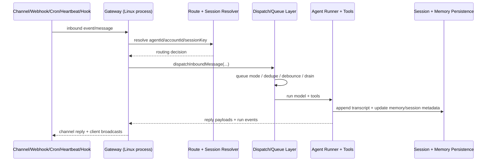

# Flutter OpenClaw Mobile — Milestone 1 Architecture Mapping

## Scope and baseline

This milestone uses the **current OpenClaw repository as the implementation baseline** (running as a Linux process via the Gateway), and skips the clone step because upstream source is already present in this repo.

## 1) OpenClaw runtime map (Linux process baseline)

### Runtime entry and host process

- CLI gateway entrypoint is exposed by `src/cli/gateway-cli.ts`.
- Gateway server startup is owned by `startGatewayServer` in `src/gateway/server.impl.ts` and re-exported via `src/gateway/server.ts`.
- Runtime environment abstraction (`RuntimeEnv`) lives in `src/runtime.ts`.

### Gateway responsibilities

The Gateway process acts as the central runtime for:

- Transport endpoints (WebSocket + HTTP) and client state.
- Channel/plugin registration and channel-specific adapters.
- Routing resolution (agent + account + session keys).
- Event fan-out to connected UI/node clients.
- Cron service lifecycle, heartbeat lifecycle, and hook wiring.
- Tool invocation APIs (`/tools/invoke`) and agent run lifecycle signals.

Primary files:

- `src/gateway/server.impl.ts`
- `src/gateway/server-http.ts`
- `src/gateway/server-ws-runtime.ts`
- `src/gateway/server-methods/*.ts`

### Session model

- Session routing and key selection are handled in `src/routing/resolve-route.ts` and `src/gateway/server-session-key.ts`.
- Session persistence contracts are in `src/config/sessions/*`.
- Transcript appends and message chain integrity use `SessionManager` via `src/config/sessions/transcript.ts` and gateway chat methods.

Session persistence layers:

1. `sessions.json` (session metadata map)
2. `<sessionId>.jsonl` transcript files

### Queue behavior and turn serialization

OpenClaw currently uses queueing patterns that are **session/lane aware** rather than one global monolithic queue object:

- Follow-up queue modes and draining are in `src/auto-reply/reply/queue/*`.
- Queue policies (cap, summarize/drop) are in `src/utils/queue-helpers.ts`.
- Inbound dispatching path is in `src/auto-reply/dispatch.ts` and `src/auto-reply/reply/dispatch-from-config.ts`.
- Lane/concurrency coordination is applied from gateway startup (`src/gateway/server-lanes.ts`).

### Event sources (Milestone 1 target: five input classes)

1. **Messages (human input)**
   - Inbound via channel adapters + gateway chat methods.
   - Core chat send/inject/history methods: `src/gateway/server-methods/chat.ts`.

2. **Heartbeats**
   - Heartbeat runner and wake path: `src/infra/heartbeat-runner.ts`, `src/infra/heartbeat-wake.ts`.
   - CLI/system hooks: `src/cli/system-cli.ts`.

3. **Cron jobs**
   - Cron service API: `src/cron/service.ts`.
   - Scheduling ops and state transitions: `src/cron/service/ops.ts` and related service modules.

4. **Internal hooks**
   - Hook event bus/registry: `src/hooks/internal-hooks.ts`.
   - Gateway hook mapping: `src/gateway/hooks.ts`, `src/gateway/hooks-mapping.ts`.

5. **Webhooks**
   - Telegram webhook runtime: `src/telegram/webhook.ts`.
   - Additional webhook surfaces are exposed through CLI/provider integrations (for example `src/cli/webhooks-cli.ts`).

### Memory model

- Memory management lives under `src/memory/*` (manager, search manager, embeddings, persistence backends).
- Session transcript + memory-related write paths interact through session files and agent tooling.
- Semantic/local memory backends are configurable in code paths under `src/memory/backend-config.ts`.

### Tool and execution interfaces

- Agent tool registry and OpenClaw tools: `src/agents/openclaw-tools.ts`, `src/agents/tools/*`.
- Shell/exec tool constraints: `src/agents/bash-tools.ts` + policy modules.
- Gateway-side tool invoke HTTP API path exists in `src/gateway/tools-invoke-http.test.ts` and server HTTP handlers.

## 2) Event ingestion to processing sequence (current-system view)

## 3) Concept parity matrix (OpenClaw -> Flutter target)

| OpenClaw concept      | Upstream implementation path(s)                                     | Flutter implementation option                                                    | Parity target | Notes                                                                      |
| --------------------- | ------------------------------------------------------------------- | -------------------------------------------------------------------------------- | ------------- | -------------------------------------------------------------------------- |
| Gateway host process  | `src/gateway/server.impl.ts`, `src/gateway/server.ts`               | `GatewayRouter` service in app layer + optional local relay process              | Partial (v1)  | Mobile likely cannot host full always-on socket gateway like Linux daemon. |
| Session routing       | `src/routing/resolve-route.ts`, `src/gateway/server-session-key.ts` | Deterministic `RouteResolver` with `(agentId, channelId, sessionId)` key builder | Full          | Keep canonical key format to ease interoperability.                        |
| Session persistence   | `src/config/sessions/*`                                             | Isar/Drift tables for session metadata + transcript records                      | Full          | Keep schema version + migration plan from day 1.                           |
| Queue + serialization | `src/auto-reply/reply/queue/*`, `src/utils/queue-helpers.ts`        | Durable FIFO queue table with status fields                                      | Full          | Explicit states: queued/processing/completed/failed/dead-letter.           |
| Message input         | `src/gateway/server-methods/chat.ts`                                | In-app chat composer -> normalized event                                         | Full          | Baseline input channel for v1.                                             |
| Heartbeat input       | `src/infra/heartbeat-runner.ts`                                     | Android WorkManager + iOS BGTask catch-up                                        | Partial       | iOS cadence is best-effort; design for deferred execution.                 |
| Cron input            | `src/cron/service.ts`, `src/cron/service/ops.ts`                    | Local scheduler + persisted next-run computation                                 | Partial       | iOS timing guarantees are limited; use missed-run replay policy.           |
| Internal hooks        | `src/hooks/internal-hooks.ts`                                       | In-app lifecycle event bus                                                       | Full          | Deterministic ordering required before enqueue.                            |
| Webhooks              | `src/telegram/webhook.ts`, `src/cli/webhooks-cli.ts`                | External relay -> push notification -> secure fetch                              | Partial       | Device should not expose public webhook endpoint directly.                 |
| Memory subsystem      | `src/memory/*`                                                      | Local memory store + optional embedding index                                    | Partial       | Start with structured local memory; semantic search in later phase.        |
| Tool sandbox          | `src/agents/tools/*`, `src/agents/bash-tools.ts`                    | Capability registry with permission gates                                        | Partial       | No unrestricted shell execution on mobile.                                 |

## 4) Mobile constraints assessment (Milestone 1 deliverable)

### iOS constraints

- No guarantee of continuous long-running background process equivalent to Linux gateway daemon behavior.
- BackgroundTasks are opportunistic; cron/heartbeat must tolerate delay.
- Public inbound webhook listener on device is not practical; use relay backend + APNs + fetch.
- Network, notification, and background modes require explicit entitlements and user-visible permissions.

### Android constraints

- WorkManager is suitable for deferred/reliable background work, but exact timing is not guaranteed under Doze/standby.
- Foreground service can extend runtime but has UX/battery/policy implications.
- Direct inbound webhooks to device are still fragile compared to relay + FCM trigger.

### Shared mobile architecture implications

- Build around a **durable event log/queue** and replay on wake/open.
- Treat scheduler inputs as "intent to run" rather than guaranteed exact-time execution.
- Keep an idempotency key on all externally-originated events (especially webhook relays).
- Make policy decisions and tool-permission outcomes explicit in persisted trace data.

## 5) Milestone 1 exit-check answers

### Q: Where does each input type enter the system, and how is it serialized/processed?

- **Messages** enter via channel/gateway chat handlers and flow into dispatch/queue/agent-runner paths.
- **Heartbeats** enter via heartbeat runner + wake handlers, then use reply/runtime paths to produce outbound events.
- **Cron** enters via cron service operations, then emits system events that are processed through normal run/reply paths.
- **Internal hooks** enter through the internal hook dispatcher and can emit additional events.
- **Webhooks** enter through provider webhook handlers (for example Telegram), then route into the same session/dispatch flow.

All five sources converge on shared routing/session resolution, dispatch/queue handling, and transcript/memory persistence.

## 6) Milestone 1 reference implementation (in this repository)

A lightweight executable reference for the Milestone 1 event model now lives in:

- `src/experiments/flutter-m1/runtime-reference.ts`
- `src/experiments/flutter-m1/runtime-reference.test.ts`

It demonstrates:

- gateway-style route resolution into `(agentId, channelId, sessionId)`
- normalization of all five input types into a shared event contract
- queue lifecycle states (`queued`, `processing`, `completed`, `failed`)
- idempotency-key deduplication
- a basic processing loop that updates event status

## 7) Next step (Milestone 2 handoff)

- Implement Flutter domain model skeleton:
  - `AgentProfile`, `Event`, `EventType`, `Session`, `MemoryEntry`, `ToolInvocation`, `RunResult`
- Implement persisted schema version and migration strategy.
- Build basic local CRUD for agents and sessions before adding schedulers/webhook relay.
