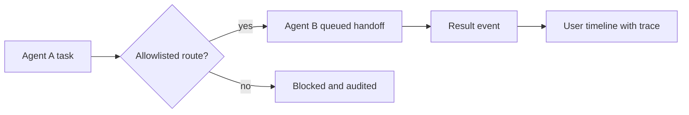

# Flutter OpenClaw Mobile - Milestone 10 Agent-to-Agent Messaging

## Scope

Milestone 10 introduces agent-to-agent messaging with explicit routing allowlists and visual
handoff traces that remain practical on a mobile device.

## Mobile feasibility model

Agent-to-agent orchestration can work on phone if heavy work is queue-driven and bounded:

- agent handoffs are persisted as normal events
- orchestration remains asynchronous (no blocking UI thread)
- long-running tasks can be delegated to relay-assisted or remote workers when needed
- user-facing state remains timeline-first and resumable after app restarts

## Reference baseline from prior milestones

- Milestone 2 entity and memory boundaries: `src/experiments/flutter-m2/milestone2-reference.ts`
- Milestone 3 route/session isolation:
  - `src/experiments/flutter-m3/gateway-router-reference.ts`
  - `src/experiments/flutter-m3/channel-session-service-reference.ts`
- Milestone 4 processing guarantees: `docs/experiments/plans/flutter-openclaw-m4-durable-queue-loop.md`
- Milestone 9 relay delivery controls: `docs/experiments/plans/flutter-openclaw-m9-webhooks.md`
- User interaction map: `docs/experiments/plans/flutter-openclaw-user-interactions.md`

## Reference implementation targets in this repository

- `src/experiments/flutter-m10/agent-handoff-reference.ts`
- `src/experiments/flutter-m10/agent-handoff-reference.test.ts`

## 1) Handoff contract

Each handoff event should include:

- `fromAgentId`
- `toAgentId`
- `handoffReason`
- `taskPayload`
- `handoffTraceId`
- allowlist decision metadata

## 2) Security and routing constraints

- deny by default for agent-to-agent routes
- explicit allowlist per source and target agent
- optional user approval for high-risk handoffs
- rate limits to prevent handoff loops

## 3) UX expectations

- users can view handoff graph/ancestry in inspector
- timeline indicates agent origin for each step
- users can pause orchestration chain and resume manually

## 4) Mobile performance constraints

- cap concurrent active agent chains on-device
- prioritize foreground session responsiveness
- degrade gracefully when offline by persisting queued handoffs

## 5) Test coverage required for Milestone 10

- allowlist enforcement for permitted and denied routes
- no infinite loop under cyclic handoff attempts
- trace continuity across multi-agent chain
- restart recovery of queued handoff events

## 6) Exit criteria

- [ ] Demonstrate agent A to agent B task pipeline end-to-end.
- [ ] Handoff routes are allowlist-gated and traceable.
- [ ] Mobile UI remains responsive during handoff processing.

## 7) Milestone 11 handoff

Milestone 11 should persist handoff traces and outputs into durable scoped memory for future runs.

## Mermaid reference diagram

