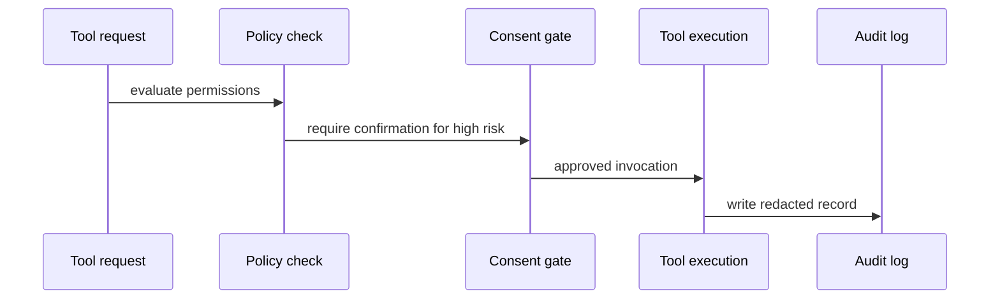

# Flutter OpenClaw Mobile - Milestone 12 Tooling and Capability Sandbox

## Scope

Milestone 12 adds a governed tool execution layer for mobile, including explicit permission checks,
audit logging, and safe defaults for high-risk actions.

## Reference baseline from prior milestones

- Milestone 4 execution and queue governance: `docs/experiments/plans/flutter-openclaw-m4-durable-queue-loop.md`
- Milestone 9 relay and external ingress trust boundaries: `docs/experiments/plans/flutter-openclaw-m9-webhooks.md`
- Milestone 10 multi-agent routing controls: `docs/experiments/plans/flutter-openclaw-m10-agent-to-agent.md`
- Milestone 11 memory provenance and inspection: `docs/experiments/plans/flutter-openclaw-m11-memory-context.md`
- User interaction and diagnostics map: `docs/experiments/plans/flutter-openclaw-user-interactions.md`

## Reference implementation targets in this repository

- `src/experiments/flutter-m12/tool-registry-reference.ts`
- `src/experiments/flutter-m12/tool-registry-reference.test.ts`

## 1) Tool registry contract

Each tool should define:

- `toolId`
- `capabilityCategory`
- `requiredPermissions`
- `riskLevel` (`low`, `medium`, `high`)
- input and output schema metadata

## 2) Permission and consent model

- default deny for tools without explicit grant
- runtime consent prompts for medium/high-risk actions
- policy checks before invocation, not after
- denylist guardrails for disallowed operations on mobile

## 3) Audit and explainability

- every invocation logs requester, decision, and outcome
- logs must redact sensitive payload fields
- inspector should show "why allowed" or "why blocked"

## 4) Mobile constraints and fallback

- tools requiring persistent background execution should use deferred jobs
- network-required tools need offline fallback messaging
- operations incompatible with mobile sandbox should be blocked with explicit explanation

## 5) Test coverage required for Milestone 12

- permission grant and revoke behavior
- blocked invocation when policy disallows tool
- audit log integrity and redaction checks
- confirmation flow for high-risk tools

## 6) Exit criteria

- [ ] Tool calls are policy-checked and audited.
- [ ] High-risk actions require explicit confirmation.
- [ ] Blocked tools produce clear user-facing explanations.

## 7) Milestone 13 handoff

Milestone 13 security hardening should formalize threat-model-driven tests over these policy and
sandbox controls.

## Mermaid reference diagram

