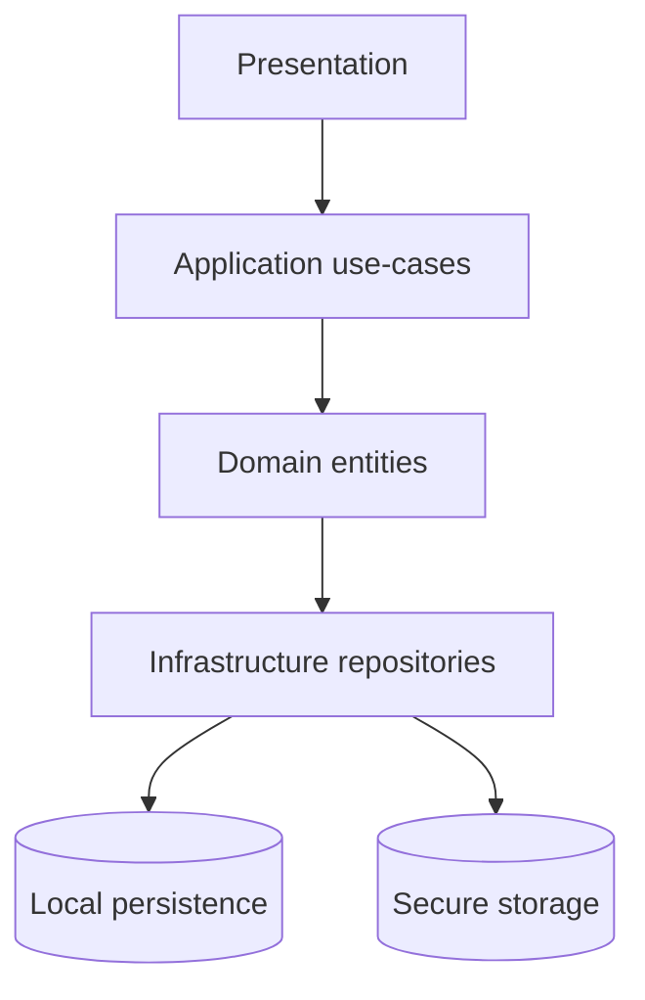

# Flutter OpenClaw Mobile — Milestone 2 Foundation and Domain Model

## Scope

This milestone defines the **first implementation slice** for the Flutter app foundation:

- layered app architecture (`presentation`, `application`, `domain`, `infrastructure`)
- core domain entities and serialization contracts
- local persistence with schema versioning + migration hooks
- minimum CRUD flows for agents and sessions

## Reference implementation links in this repository

Milestone 2 now has an executable reference implementation in:

- `src/experiments/flutter-m2/milestone2-reference.ts`
- `src/experiments/flutter-m2/milestone2-reference.test.ts`

Deliverable-to-code mapping:

- **Core domain entities**: `AgentProfile`, `Session`, `Event`, `MemoryEntry`, `ToolInvocation`, `RunResult`, `EventType` are modeled in `milestone2-reference.ts`.
- **Session identity and routing alignment**: `buildSessionKey(...)` mirrors milestone guidance for `agent/channel/session` identity composition.
- **Schema versioning + migration entrypoint**: `Milestone2SchemaVersion`, `migrateStore(...)`, `serializeStore(...)`, `deserializeStore(...)`.
- **CRUD baseline**: `Milestone2Repository` methods (`createAgent`, `updateAgent`, `createSession`, `listSessionsByAgent`, `appendEvent`).
- **Idempotency behavior for queued events**: enforced in `appendEvent(...)` using `idempotencyKey`.
- **Verification tests**: `milestone2-reference.test.ts` covers CRUD flows, v1->v2 migration, idempotency dedupe, and export/import round-trips.
- **Relay readiness for mobile ingress**: align persisted event/idempotency contracts with [Relay API Architecture](/experiments/plans/flutter-openclaw-relay-architecture) so Milestone 3 can fetch/ingest relay batches safely.

## 1) Milestone 2 deliverables mapped to concrete outputs

### A. Flutter project baseline

Target repository structure (inside the Flutter app root):

```text
lib/
  presentation/
    screens/
    widgets/
    state/
  application/
    usecases/
    services/
    dto/
  domain/
    entities/
    value_objects/
    repositories/
  infrastructure/
    persistence/
    adapters/
    logging/
```

Principles:

- `domain` contains no Flutter/UI package dependencies.
- `application` orchestrates use cases and repository interfaces.
- `infrastructure` implements persistence/logging adapters.
- `presentation` binds Riverpod state + UI navigation.

### B. Core domain entities (required in this milestone)

- `AgentProfile`
- `Event`
- `EventType`
- `Session`
- `MemoryEntry`
- `ToolInvocation`
- `RunResult`

Domain entity requirements:

- stable IDs (`uuid` style)
- `createdAt` and `updatedAt` timestamps
- pure-model validation (no UI logic)
- deterministic JSON serialization for import/export

### C. Serialization and schema versioning

- include explicit schema version field (for example `schemaVersion`) at persistence root level
- keep `fromJson` resilient to unknown fields
- add migration dispatcher for `v1 -> v2` style upgrades

### D. Local persistence and secrets boundary

- app data store (Drift preferred) for entities and queue/event data
- secure storage (Keychain/Keystore via Flutter secure storage) for secrets only
- never store provider credentials in plain-text tables

### E. Baseline app behavior

- create/list/update/delete `AgentProfile`
- create/list sessions per agent
- persist and reload state after app restart

## 2) Initial schema proposal (Milestone 2 scope)

```text
schema_meta(
  key TEXT PRIMARY KEY,
  value TEXT NOT NULL
)

agent_profiles(
  id TEXT PRIMARY KEY,
  name TEXT NOT NULL,
  default_model TEXT,
  system_prompt TEXT,
  is_enabled INTEGER NOT NULL,
  created_at INTEGER NOT NULL,
  updated_at INTEGER NOT NULL
)

sessions(
  id TEXT PRIMARY KEY,
  agent_id TEXT NOT NULL,
  channel_id TEXT NOT NULL,
  session_key TEXT NOT NULL,
  title TEXT,
  last_message_at INTEGER,
  created_at INTEGER NOT NULL,
  updated_at INTEGER NOT NULL
)

events(
  id TEXT PRIMARY KEY,
  session_id TEXT NOT NULL,
  event_type TEXT NOT NULL,
  source TEXT NOT NULL,
  payload_json TEXT NOT NULL,
  status TEXT NOT NULL,
  idempotency_key TEXT,
  created_at INTEGER NOT NULL,
  updated_at INTEGER NOT NULL
)

memory_entries(
  id TEXT PRIMARY KEY,
  agent_id TEXT,
  session_id TEXT,
  scope TEXT NOT NULL,
  content TEXT NOT NULL,
  tags_json TEXT,
  created_at INTEGER NOT NULL,
  updated_at INTEGER NOT NULL
)

tool_invocations(
  id TEXT PRIMARY KEY,
  run_id TEXT NOT NULL,
  tool_name TEXT NOT NULL,
  request_json TEXT NOT NULL,
  response_json TEXT,
  status TEXT NOT NULL,
  created_at INTEGER NOT NULL,
  updated_at INTEGER NOT NULL
)

run_results(
  id TEXT PRIMARY KEY,
  event_id TEXT NOT NULL,
  session_id TEXT NOT NULL,
  final_text TEXT,
  usage_json TEXT,
  status TEXT NOT NULL,
  error_text TEXT,
  created_at INTEGER NOT NULL,
  updated_at INTEGER NOT NULL
)
```

## 3) Entity contract guidance

### EventType (enum seed)

- `message`
- `heartbeat`
- `cron`
- `internalHook`
- `webhook`
- `agentMessage` (optional early support)

### Event status (queue compatibility)

- `queued`
- `processing`
- `completed`
- `failed`
- `deadLetter`

### Session identity alignment with OpenClaw concepts

To preserve parity with current OpenClaw semantics from Milestone 1:

- keep a persisted `sessionKey` separate from storage `id`
- keep `channelId` and `agentId` explicit fields
- reserve optional `accountId` and `threadId` fields for future channel adapters

## 4) Use-case slice for this milestone

Minimal application use cases:

- `CreateAgentProfileUseCase`
- `UpdateAgentProfileUseCase`
- `ListAgentProfilesUseCase`
- `CreateSessionUseCase`
- `ListSessionsByAgentUseCase`
- `AppendEventUseCase`

Acceptance checks:

- App cold-start loads existing agents/sessions from local DB.
- Updating agent settings persists and survives restart.
- Creating events writes persisted rows with deterministic JSON payload encoding.

## 5) Test plan for Milestone 2

### Unit tests

- entity serialization/deserialization round-trip tests
- enum/value validation tests
- migration dispatcher tests for unknown/older schema versions

### Persistence tests

- repository CRUD for `agent_profiles` and `sessions`
- integrity checks (`session.agent_id` references valid agent)
- restart simulation (close DB/reopen/load)

### Application tests

- use-case tests with repository fakes/mocks
- verify timestamp updates and status transitions

## 6) Risks and mitigations for Milestone 2

- **Schema churn risk**: keep migration hooks from v1 rather than direct table rewrites.
- **Layer leakage risk**: disallow UI dependencies in `domain`/`application` packages.
- **Serialization drift risk**: centralize `toJson/fromJson` logic per entity and test round-trips.
- **Secret sprawl risk**: enforce secure-storage-only policy for credentials.

## 7) Exit criteria checklist (Milestone 2)

- [ ] Flutter app runs on Android and iOS.
- [ ] Layered package structure exists and is enforced in code review.
- [ ] All required Milestone 2 entities are implemented with JSON contracts.
- [ ] Local persistence includes schema versioning and migration entrypoint.
- [ ] Agent and session CRUD survive app restart.
- [ ] Baseline tests pass for entities, repositories, and use cases.

## 8) Milestone 3 handoff

After this milestone completes, proceed to Gateway abstraction and channel session routing:

- Milestone 3 implementation document: [Flutter OpenClaw Mobile — Milestone 3 Gateway Router and Channel Sessions](/experiments/plans/flutter-openclaw-m3-gateway-router-sessions)
- add `GatewayRouter` interface in `application/services`
- wire route resolution into session lookup and event insertion
- enforce FIFO non-interleaving behavior per session queue key

Milestone 2 dependency handoff to Milestone 3:

- `buildSessionKey(...)` from the Milestone 2 reference becomes the canonical route/session identity primitive.
- `Milestone2Repository.createSession(...)` provides create-if-missing session behavior for routed events.
- `Milestone2Repository.appendEvent(...)` provides idempotency-key dedupe at ingestion boundaries.
- schema migration path (`migrateStore`) remains unchanged; Milestone 3 should avoid schema-breaking changes unless required.

## Mermaid reference diagram


