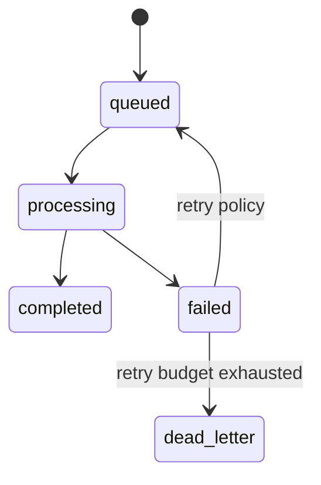

# Flutter OpenClaw Mobile — Milestone 4 Durable Queue and Processing Loop

## Scope

Milestone 4 turns the Milestone 3 routing/session layer into a restart-safe processing runtime:

- durable queue persistence and status transitions
- retry policy with dead-letter handling
- idempotent ingest and replay safety
- recovery after app kill/restart/background suspension

## Reference baseline from prior milestones

### Milestone 1 references

- Event/queue lifecycle model: `src/experiments/flutter-m1/runtime-reference.ts`
- Baseline processing loop: `runMilestone1ProcessingLoop(...)`

### Milestone 2 references

- Durable entities and persistence contracts: `src/experiments/flutter-m2/milestone2-reference.ts`
- Event status contract includes `deadLetter`: `EventStatus`
- Repository ingest idempotency boundary: `Milestone2Repository.appendEvent(...)`

### Milestone 3 references

- Route/session ingress + per-session drain gating:
  - `src/experiments/flutter-m3/gateway-router-reference.ts`
  - `src/experiments/flutter-m3/channel-session-service-reference.ts`

### Relay references

- Internet-to-mobile delivery model:
  - `src/experiments/flutter-relay/api-relay-reference.ts`
  - `docs/experiments/plans/flutter-openclaw-relay-architecture.md`

## Reference implementation links in this repository

Milestone 4 reference implementation targets:

- `src/experiments/flutter-m4/durable-queue-reference.ts`
- `src/experiments/flutter-m4/processing-loop-reference.ts`
- `src/experiments/flutter-m4/durable-queue-reference.test.ts`
- `src/experiments/flutter-m4/processing-loop-reference.test.ts`

Integration expectations:

- queue records are materialized from Milestone 2 `Event` entries
- enqueue entrypoint consumes Milestone 3/relay-ingested events
- processing loop preserves per-session FIFO non-interleaving guarantees from Milestone 3

## 1) Durable queue model

Queue record fields (logical model):

- `queueItemId`
- `eventId`
- `sessionKey`
- `status`: `queued | processing | completed | failed | deadLetter`
- `attempts`
- `nextAttemptAt`
- `lastError`
- `createdAt`
- `updatedAt`

State transitions:

1. `queued -> processing`
2. `processing -> completed`
3. `processing -> failed` (retryable)
4. `failed -> queued` (when retry window reached)
5. `failed -> deadLetter` (max attempts exceeded or non-retryable)

## 2) Retry and dead-letter policy

Default policy (initial production baseline):

- max attempts: `3`
- backoff: exponential (`5s`, `15s`, `45s`)
- jitter: +/- 20%
- non-retryable classes (configuration/validation errors) go directly to `deadLetter`

Dead-letter requirements:

- preserve original payload, route identity, and last error
- keep remediation metadata (`manualRetryAllowed`, `firstFailedAt`, `lastFailedAt`)
- expose in diagnostics/export bundle

## 3) Processing loop contract

Loop responsibilities:

- claim next eligible queue item (`status=queued`, `nextAttemptAt<=now`)
- enforce one active processor per `sessionKey`
- execute handler (model/tool chain placeholder in reference)
- update terminal or retry state atomically
- emit lifecycle telemetry (`claimed`, `processed`, `retried`, `deadLettered`)

Pseudo-flow:

1. load eligible items sorted by `(nextAttemptAt, createdAt)`
2. skip items whose `sessionKey` is currently active
3. mark one item `processing`
4. run handler
5. commit result state
6. release session lock
7. continue until no eligible items

## 4) Restart recovery behavior

On app startup / resume:

- scan for stale `processing` items
- mark stale `processing` as `failed` with recovery error reason
- schedule retry (`nextAttemptAt = now + recoveryBackoff`)
- resume normal queue drain loop

Stale threshold guidance:

- treat `processing` item as stale if heartbeat/update timestamp is older than `2x` expected worker lease duration

## 5) Relay and mobile lifecycle integration

Ingress path:

1. Relay delivers pending events to mobile.
2. Milestone 3 ingest persists event + session routing.
3. Milestone 4 enqueue service creates queue records for the event.
4. Worker loop processes when allowed by app lifecycle + session lock.

Background behavior:

- Android: WorkManager drain windows
- iOS: BGTask opportunistic windows + foreground catch-up
- keep batches bounded per run to avoid OS termination

## 6) UI and diagnostics outputs

Add queue visibility surfaces:

- queue overview counts by status
- per-session queue depth
- dead-letter list with retry action
- last loop run summary (processed/retried/dead-lettered)

## 7) Test coverage required for Milestone 4

- enqueue persists queue records with deterministic state
- retry progression and backoff math
- dead-letter transition after max attempts
- stale `processing` recovery on startup
- per-session non-interleaving under concurrent queued items
- relay-ingested events reach queue and process end-to-end

## 8) Exit criteria (Milestone 4)

- [ ] Durable queue schema/records persist across app restarts.
- [ ] Processing loop recovers cleanly from interrupted `processing` states.
- [ ] Retry + dead-letter behavior works with deterministic tests.
- [ ] Per-session FIFO + no-interleaving guarantees remain intact.
- [ ] Queue/dead-letter diagnostics are inspectable in-app or exportable.

## 9) Milestone 5 handoff

Milestone 5 implementation document: [Flutter OpenClaw Mobile — Milestone 5 Human Messages UX](/experiments/plans/flutter-openclaw-m5-human-message-ux)

Milestone 5 (human message UX) should consume Milestone 4 runtime primitives:

- composer events enqueue through durable queue path
- timeline renders queue + processing states in order
- typing/processing indicators reflect durable worker state

## Mermaid reference diagram

