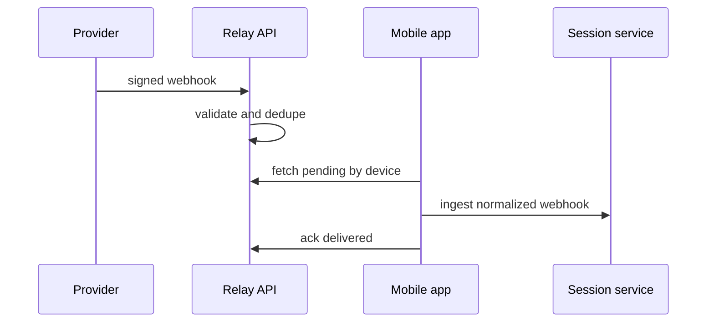

# Flutter OpenClaw Mobile - Milestone 9 Webhooks

## Scope

Milestone 9 operationalizes internet-origin webhook delivery for mobile by hardening the relay
model and binding it to the existing routing and queue contracts.

## Reference baseline from prior milestones

- Relay reference implementation and tests:
  - `src/experiments/flutter-relay/api-relay-reference.ts`
  - `src/experiments/flutter-relay/api-relay-reference.test.ts`
- Milestone 3 routing/session ingestion:
  - `src/experiments/flutter-m3/gateway-router-reference.ts`
  - `src/experiments/flutter-m3/channel-session-service-reference.ts`
- Milestone 4 durability and retries: `docs/experiments/plans/flutter-openclaw-m4-durable-queue-loop.md`
- Milestone 8 deterministic hook/event ancestry: `docs/experiments/plans/flutter-openclaw-m8-internal-hooks.md`

## Reference implementation targets in this repository

- `src/experiments/flutter-m9/webhook-relay-hardening-reference.ts`
- `src/experiments/flutter-m9/webhook-relay-hardening-reference.test.ts`

## 1) Relay hardening requirements

- signature verification per provider
- provider-specific validation policies
- per-tenant and per-device rate limits
- replay and idempotency protection
- observability logs with redaction

## 2) Delivery model to mobile

- push notification or wake signal prompts app sync
- app fetches pending relay items by `deviceId`
- app ingests through Milestone 3 service
- app acknowledges delivery with durable ack semantics

## 3) Failure and retry behavior

- if ingestion fails, relay item remains pending with retry metadata
- if ingestion reports duplicate, relay may ack as delivered duplicate
- relay backlog health is visible in diagnostics and alerts

## 4) UX expectations

- integrations panel shows provider status, auth state, and last delivery
- timeline entries include provider/source metadata
- users can force refresh relay fetch when debugging

## 5) Test coverage required for Milestone 9

- signature failure and unauthorized rejection
- duplicate idempotency behavior
- fetch and ack lifecycle under partial failures
- cross-device isolation and targeting behavior

## 6) Exit criteria

- [ ] External provider event appears in timeline with source metadata.
- [ ] Relay delivery path is authenticated and replay-safe.
- [ ] Pending and failed deliveries are inspectable and retryable.

## 7) Milestone 10 handoff

Milestone 10 should reuse relay-grade routing controls for secure agent-to-agent handoff envelopes.

## Mermaid reference diagram

