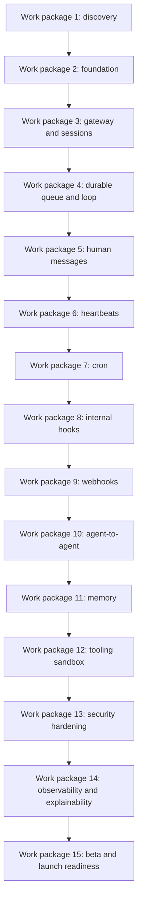

# Flutter OpenClaw-Style Mobile App Milestones (Android + iOS)

## 0) Scope, Principles, and Success Criteria

### Goals

Build a Flutter app that functionally emulates OpenClaw-style architecture and behavior for mobile
usage:

- Gateway-style input routing
- Event queue plus processing loop
- Five event inputs (messages, heartbeats, cron jobs, internal hooks, webhooks)
- Optional agent-to-agent messaging
- Persistent local memory
- Practical security controls

### Non-goals (initially)

- Perfect parity with every OpenClaw skill and integration
- Unrestricted device-level command execution (mobile sandbox differs from desktop)
- Autonomous background behavior that violates iOS and Android constraints

### Program-level definition of done

- Mobile app demonstrates all major input sources and the processing loop
- Users can define multiple agents, schedules, and channels
- State persists across sessions and app restarts
- Security controls are visible, default-on, and testable

Reference architecture: [Flutter OpenClaw Mobile — Relay API Architecture](/experiments/plans/flutter-openclaw-relay-architecture)

## 1) Agent-executable work packages

### Work package 1 — Discovery, repo intake, and architecture mapping

#### Assumed app state

- No production Flutter runtime behavior is required yet; this package is planning and architecture
  baselining.
- The repository contains architecture mapping and constraints docs that implementation packages can
  execute against.

#### High-level testable checks

- Can review and trace all five input types from ingress to persistence in docs.
- Can identify, in writing, mobile platform constraints and proposed mitigations.

#### Deliverables

- Clone and inspect `openclaw/openclaw` _(already completed in this repository)_
- Milestone 1 architecture mapping document: [Flutter OpenClaw Mobile — Milestone 1 Architecture Mapping](/experiments/plans/flutter-openclaw-m1-architecture-mapping)
- Produce architecture mapping doc for:
  - Core runtime loop
  - Gateway responsibilities
  - Session model
  - Queue behavior
  - Event sources
  - Memory model
  - Tool and execution interfaces
- Produce Flutter/mobile constraints assessment for:
  - iOS background execution limits
  - Android WorkManager/background service limits
  - Notification, webhook, and local scheduling constraints

#### Codex prompts (examples)

- "Clone OpenClaw and summarize runtime modules, queue/event flow, and persistence contracts."
- "Map each OpenClaw concept to a Flutter-compatible implementation option and call out gaps."
- "Generate sequence diagrams for event ingestion to queue to agent turn to persistence."

#### Exit criteria

- Team can answer: where each input type enters the system, and how it is serialized and processed

### Work package 2 — Flutter foundation and domain model

#### Assumed app state

- App can launch on iOS and Android simulator/device.
- User can create, view, edit, and delete agents and sessions stored locally on the mobile device
  (for example in app-managed SQLite or object storage).
- Agents and sessions are local runtime records (configuration, conversation context, queue metadata),
  not remote long-lived processes.
- Model execution can still call remote LLM/provider APIs using configured API keys, but scheduling,
  routing, queue state, and session memory remain device-local in this work package.
- Domain entities serialize and deserialize with schema version metadata.

#### High-level testable checks

- Can open app and create an agent profile.
- Can create a session, restart app, and still see agent/session data.
- Can run schema serialization round-trip tests without data loss.

#### Deliverables

- Milestone 2 implementation document: [Flutter OpenClaw Mobile — Milestone 2 Foundation and Domain Model](/experiments/plans/flutter-openclaw-m2-foundation-domain-model)
- New Flutter app baseline with layers:
  - `presentation/`
  - `application/`
  - `domain/`
  - `infrastructure/`
- Core domain entities:
  - `AgentProfile`
  - `Event`
  - `EventType`
  - `Session`
  - `MemoryEntry`
  - `ToolInvocation`
  - `RunResult`
- JSON serialization contracts and local schema versioning

#### Recommended choices

- State management: Riverpod (or Bloc; choose one early)
- Persistence: Drift or Isar plus encrypted secure storage for secrets
- Logging: structured logs persisted locally plus export option

#### Exit criteria

- App runs on iOS and Android and can CRUD agents and sessions locally

### Work package 3 — Gateway abstraction and channel sessions

#### Assumed app state

- Inbound envelopes route through a gateway abstraction.
- Session boundaries are enforced per channel.
- Timeline/inbox read models reflect routed events.

#### High-level testable checks

- Can ingest events from two channels and see isolated session histories.
- Can send rapid events to one session and verify FIFO/no-interleaving behavior.
- Can confirm duplicate idempotency keys are rejected.

#### Deliverables

- Milestone 3 implementation document: [Flutter OpenClaw Mobile — Milestone 3 Gateway Router and Channel Sessions](/experiments/plans/flutter-openclaw-m3-gateway-router-sessions)
- Implement `GatewayRouter` abstraction:
  - Ingest relay-delivered envelopes fetched from Relay API
  - Accept inbound events from channels
  - Route to `(agentId, channelId, sessionId)`
- Session behavior:
  - Separate context per channel
  - Per-session FIFO ordering
  - No interleaving turns in the same session
- UI:
  - Channel inbox list
  - Per-session event timeline

#### Exit criteria

- Multiple channels can send messages while preserving isolated context and ordering

### Work package 4 — Event queue and processing loop

#### Assumed app state

- Durable queue exists with lifecycle states (`queued`, `processing`, `completed`, `failed`).
- Retry and dead-letter handling are implemented.
- Processing resumes correctly after app restart.

#### High-level testable checks

- Can enqueue an event and observe lifecycle transitions in diagnostics.
- Can force a failure and observe retry/backoff then dead-letter behavior.
- Can kill app mid-processing and recover queue state on relaunch.

#### Deliverables

- Milestone 4 implementation document: [Flutter OpenClaw Mobile — Milestone 4 Durable Queue and Processing Loop](/experiments/plans/flutter-openclaw-m4-durable-queue-loop)
- Durable queue service:
  - Event states: queued, processing, completed, failed
  - Retry policy plus dead-letter strategy
  - Idempotency keys for duplicate inbound events
- Agent processing loop:
  - Dequeue next eligible event
  - Load memory and session context
  - Run model/tool chain
  - Persist outputs and status

#### Exit criteria

- Queue state recovers correctly after app kill/restart during processing

### Work package 5 — Input type #1: Human messages

#### Assumed app state

- User-facing chat composer and session timeline are functional.
- Human message events flow through shared gateway + queue path.
- Status chips show queue/processing state.

#### High-level testable checks

- Can open app, send a message, and receive an ordered response in timeline.
- Can send multiple messages quickly and preserve order in same session.
- Can retry a failed message and observe updated status.

#### Deliverables

- Milestone 5 implementation document: [Flutter OpenClaw Mobile — Milestone 5 Human Messages UX](/experiments/plans/flutter-openclaw-m5-human-message-ux)
- In-app chat UX for user-to-agent messaging
- Message events normalized through gateway and queue
- Typing/processing state and ordered response rendering

#### Exit criteria

- Rapid user messages are processed in order within a session

### Work package 6 — Input type #2: Heartbeats

#### Assumed app state

- Heartbeat schedules can be configured per agent.
- Heartbeat events are generated and processed through same queue path as messages.
- Suppression token behavior can mute noisy repeated heartbeats.

#### High-level testable checks

- Can open app and enable heartbeat for an agent.
- Can observe heartbeat event appear in timeline with source metadata.
- Can validate suppression behavior when token is returned.

#### Deliverables

- Milestone 6 implementation document: [Flutter OpenClaw Mobile - Milestone 6 Heartbeats](/experiments/plans/flutter-openclaw-m6-heartbeats)
- Configurable heartbeat per agent:
  - Interval
  - Active hours
  - Prompt template
- Platform implementation:
  - Android WorkManager
  - iOS background task plus fallback on app open and push-trigger
- Suppression token behavior (for example `HEARTBEAT_OK`) to reduce noise

#### Exit criteria

- Heartbeat events follow the same queue path and behavior as chat messages

### Work package 7 — Input type #3: Cron jobs

#### Assumed app state

- User can configure multiple cron-style schedules.
- Missed-run policy and timezone handling are active.
- Cron events appear in timeline via shared event pipeline.

#### High-level testable checks

- Can open app and set up at least one cron schedule.
- Can observe scheduled run generate a cron event and complete processing.
- Can simulate missed run and verify chosen policy outcome (`skip` or catch-up).

#### Deliverables

- Milestone 7 implementation document: [Flutter OpenClaw Mobile - Milestone 7 Cron Jobs](/experiments/plans/flutter-openclaw-m7-cron-jobs)
- Cron-like scheduler UI:
  - Daily
  - Weekly
  - Custom schedule
- Per-schedule prompt instructions
- Time zone handling and missed-run policy
- Notification/reporting for triggered outcomes

#### Exit criteria

- At least three schedules can be configured and reliably create events

### Work package 8 — Input type #4: Internal hooks

#### Assumed app state

- Lifecycle hooks (startup, turn start/end, reset, memory flush) emit internal events.
- Hook chains are traceable with ancestry metadata.
- Hook events follow deterministic queue ordering.

#### High-level testable checks

- Can relaunch app and observe startup hook event before first manual action.
- Can inspect diagnostics to trace hook-generated child events.
- Can force hook failure and verify retry/failure visibility.

#### Deliverables

- Milestone 8 implementation document: [Flutter OpenClaw Mobile - Milestone 8 Internal Hooks](/experiments/plans/flutter-openclaw-m8-internal-hooks)
- Hook system for lifecycle events:
  - App startup
  - Agent turn start/end
  - Reset/stop
  - Memory flush
- Hook rules UI (optional in v1; config-only is acceptable)
- Deterministic ordering when hooks emit downstream events

#### Exit criteria

- Startup hook can run setup instructions and persist results before first interaction

### Work package 9 — Input type #5: Webhooks

#### Assumed app state

- External providers can deliver signed webhooks to relay.
- Mobile app can fetch pending relay events and ack delivery.
- Webhook events merge into existing session timeline model.

#### High-level testable checks

- Can send test webhook and see event in app timeline.
- Can verify invalid signature is rejected.
- Can verify duplicate idempotency webhook does not create duplicate run.

#### Deliverables

- Milestone 9 implementation document: [Flutter OpenClaw Mobile - Milestone 9 Webhooks](/experiments/plans/flutter-openclaw-m9-webhooks)
- Production relay backend for external webhooks (GitHub, Slack, email providers), backed by the Relay API architecture
- Authenticated webhook ingestion and signature verification
- Relay forwards normalized events via push plus fetch or secure polling

#### Exit criteria

- External webhook triggers an agent run and appears in the timeline with source metadata

### Work package 10 — Agent-to-agent messaging

#### Assumed app state

- Agent handoff between allowlisted agents is supported.
- Multi-agent chains are asynchronous and queue-driven on mobile.
- Handoff traces are visible in inspector/timeline.

#### High-level testable checks

- Can run a task where Agent A delegates to Agent B and returns a result.
- Can verify non-allowlisted route is blocked.
- Can verify no infinite loop under cyclic handoff attempts.

#### Deliverables

- Milestone 10 implementation document: [Flutter OpenClaw Mobile - Milestone 10 Agent-to-Agent Messaging](/experiments/plans/flutter-openclaw-m10-agent-to-agent)
- Multi-agent orchestration:
  - Agent A sends task message to Agent B
  - Isolated memory/workspace by agent
  - Explicit routing rules and allowlist
- Visual trace for inter-agent handoffs

#### Exit criteria

- Demonstrated research-agent to writer-agent pipeline end-to-end

### Work package 11 — Persistent local memory and context

#### Assumed app state

- Memory scopes (global, per-agent, per-session) are persisted.
- Memory compaction/summarization is available.
- Runs can reference prior context after restart.

#### High-level testable checks

- Can create memory entries, restart app, and read them back.
- Can inspect memory provenance for an agent response.
- Can run compaction and verify essential context remains.

#### Deliverables

- Milestone 11 implementation document: [Flutter OpenClaw Mobile - Milestone 11 Memory and Context](/experiments/plans/flutter-openclaw-m11-memory-context)
- Markdown-like memory representation persisted locally (or equivalent structured storage with
  markdown export)
- Memory scopes:
  - Global user preferences
  - Per-agent memory
  - Per-session history
- Memory compaction and summarization jobs

#### Exit criteria

- Agent references prior-day context after restart with inspectable local memory artifacts

### Work package 12 — Tooling layer and capability sandbox

#### Assumed app state

- Tool registry enforces permission policy before invocation.
- High-risk actions require explicit confirmation.
- Tool invocations are logged with redaction and decision metadata.

#### High-level testable checks

- Can attempt tool call without permission and see blocked result.
- Can grant permission and complete tool invocation.
- Can inspect audit record showing allow or deny reason.

#### Deliverables

- Milestone 12 implementation document: [Flutter OpenClaw Mobile - Milestone 12 Tooling and Capability Sandbox](/experiments/plans/flutter-openclaw-m12-tooling-sandbox)
- `ToolRegistry` abstraction with permissions for:
  - Browser/search APIs
  - Calendar/email integrations
  - Messaging connectors
- Explicit consent screens and runtime permission checks
- Dangerous actions blocked by default

#### Exit criteria

- Every tool call is logged, attributed, and policy-checked pre-execution

### Work package 13 — Security hardening

#### Assumed app state

- Security controls are default-deny for risky integrations/actions.
- Prompt-injection and credential leakage defenses are active.
- High-risk operations require explicit user confirmation.

#### High-level testable checks

- Can run security checklist scenarios and pass required controls.
- Can verify red-team prompts do not bypass policy gates.
- Can confirm sensitive data is redacted in logs and exports.

#### Deliverables

- Threat model focused on:
  - Prompt injection
  - Malicious integrations/skills
  - Credential leakage
  - Unintended command/action execution
- Security controls:
  - Allowlist-only integrations
  - Signed plugin manifests
  - Secret vaulting
  - PII redaction in logs
  - High-risk confirmation gates
- Security test checklist and red-team scenarios

#### Exit criteria

- Security review passes checklist and high-risk operations require explicit confirmation

### Work package 14 — UX, observability, and explainability

#### Assumed app state

- Inspector exposes source, queue status, trace, memory I/O, and tool invocations.
- "Why did this happen" ancestry is available for each action.
- Diagnostics bundles can be exported for triage.

#### High-level testable checks

- Can select a timeline item and trace ancestry to triggering input.
- Can view policy decision history for a blocked or allowed action.
- Can export diagnostics and validate expected artifacts are included.

#### Deliverables

- Event inspector UI showing:
  - Source input type
  - Queue status
  - Execution trace
  - Memory reads/writes
  - Tool invocations
- "Why did this happen?" panel for event ancestry tracing
- Exportable diagnostics bundle

#### Exit criteria

- Any action can be traced to the triggering event and policy decisions

### Work package 15 — Beta, validation, and launch readiness

#### Assumed app state

- Closed beta build is deployable to TestFlight and Play Internal Testing.
- Reliability and operational runbooks are documented.
- Rollback and incident workflows are rehearsed.

#### High-level testable checks

- Can install beta build and execute core message/schedule/webhook flows.
- Can run durability/offline/duplicate-event test suite successfully.
- Can execute rollback checklist and verify controlled recovery.

#### Deliverables

- Closed beta on TestFlight and Play Internal Testing
- Reliability tests for:
  - Queue durability
  - Scheduler drift
  - Offline/online sync
  - Duplicate webhook handling
- Launch docs:
  - Architecture
  - Security posture
  - Known platform limitations
  - Incident response workflow

#### Exit criteria

- Stable beta with documented limitations and rollback plan

## 2) Practical AI coding agent execution loop

For each work package, use this sequence:

1. Ask Codex for implementation plan (files, classes, tests, risks)
2. Ask Codex for an incremental patch (small PR-sized change)
3. Run tests/lints/build locally
4. Ask Codex for threat/risk review of its patch
5. Commit and update changelog

Base prompt template:

> Implement Milestone X for the Flutter OpenClaw app. Keep changes under N files. Include unit
> tests and an architecture note.

## Prompt catalog for AI coding agents

- Work-package prompts: [Flutter OpenClaw Mobile Agent Prompt Catalog](/experiments/plans/flutter-openclaw-agent-prompts)

## Implementation readiness

- Implementation readiness review and execution plan: [Flutter OpenClaw Mobile Implementation Readiness and Execution Steps](/experiments/plans/flutter-openclaw-implementation-readiness)

## Interaction flow reference

- User interaction diagrams: [Flutter OpenClaw Mobile User Interaction Flows](/experiments/plans/flutter-openclaw-user-interactions)

## 3) Repository intake steps for OpenClaw (required early work)

- Create a separate workspace folder for upstream reference:
  - `third_party/openclaw/` (read-only mirror)
- Clone upstream:
  - `git clone https://github.com/openclaw/openclaw.git third_party/openclaw`
- Snapshot important artifacts:
  - Architecture docs
  - Runtime loop code
  - Event and queue models
  - Memory/persistence modules
  - Scheduler and webhook handling paths
- Produce a Concept Parity Matrix with columns:
  - OpenClaw concept
  - Upstream implementation path
  - Flutter implementation choice
  - Parity status (`full`, `partial`, `deferred`)
  - Platform caveats
- Revisit the matrix at each milestone review

## 4) Suggested backlog epics

- EPIC A: Runtime core (gateway, queue, loop)
- EPIC B: Input sources (message, heartbeat, cron, hooks, webhooks)
- EPIC C: Multi-agent orchestration
- EPIC D: Memory plus persistence
- EPIC E: Tooling plus integrations
- EPIC F: Security plus governance
- EPIC G: UX plus explainability
- EPIC H: Mobile release engineering

## 5) Key risks and mitigations

### iOS background execution limits

Mitigation: hybrid model using scheduled tasks, push-triggered fetch, and app-open catch-up.

### Webhook delivery to mobile devices

Mitigation: relay backend and signed event envelopes.

### Security drift while tools expand

Mitigation: default-deny permissions, scoped grants, and integration reviews.

### Autonomy expectation mismatch

Mitigation: explicit trace/explainability UI showing event-driven causality.

## Mermaid reference diagram

