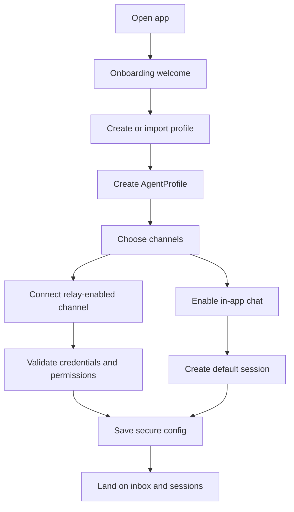
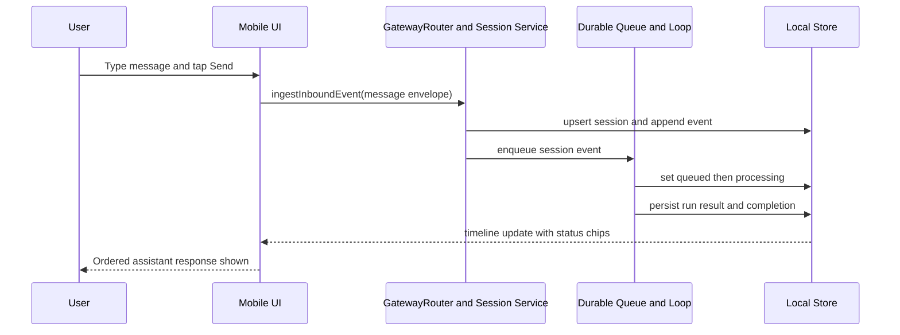
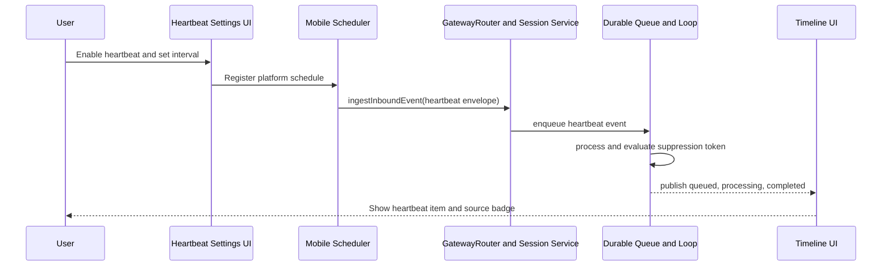
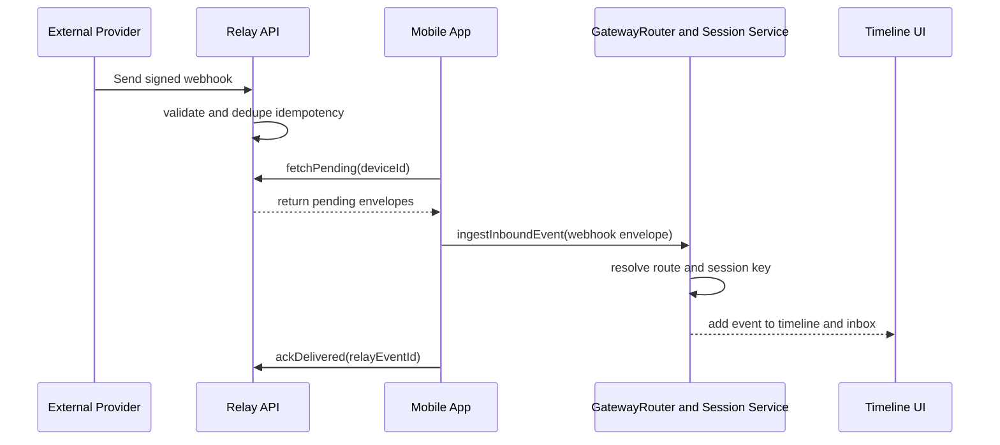
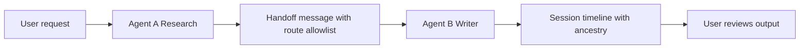
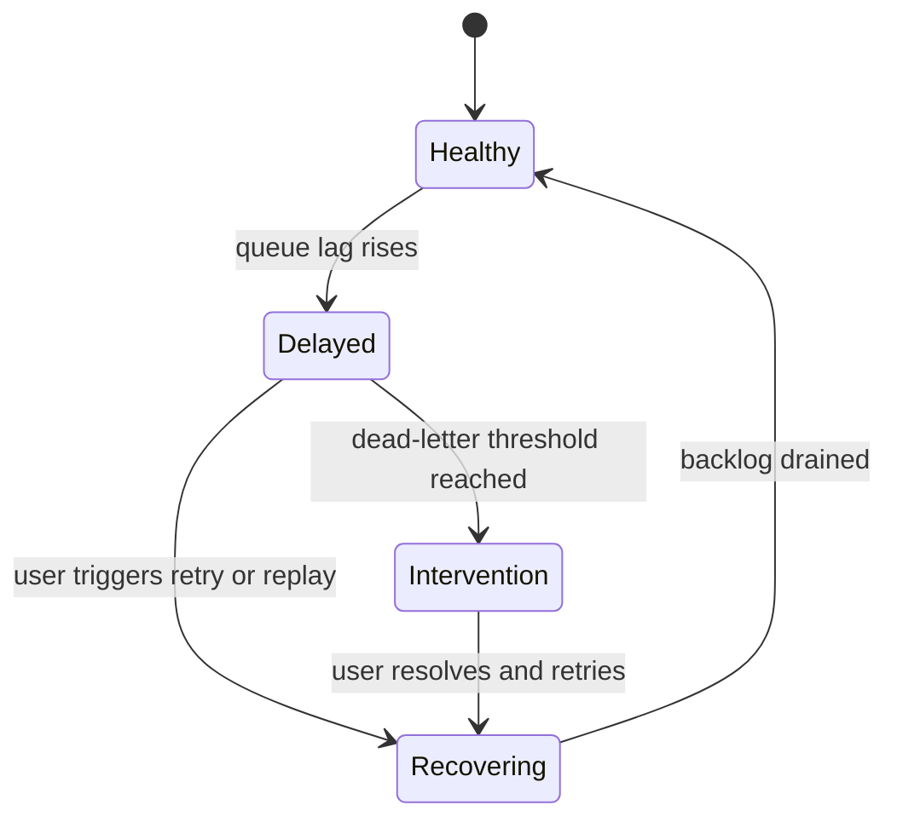

# Flutter OpenClaw Mobile User Interaction Flows

This document outlines how a user interacts with the app to use major OpenClaw-style features,
with Mermaid diagrams that map user actions to the relay, routing, queue, and timeline runtime
contracts from Milestones 1 to 6.

## 1) First run and agent setup flow

User goals:

- install app and complete onboarding
- create first agent profile
- connect at least one channel and local session
- enable runtime inputs (message, heartbeat, schedules)

## 2) Human message interaction flow

User goals:

- send a chat message
- see queued and processing states
- receive ordered response in the same session timeline

## 3) Heartbeat interaction flow

User goals:

- configure periodic agent check-ins
- ensure heartbeats use same processing path as messages
- avoid noise with suppression behavior

## 4) Webhook and relay interaction flow

User goals:

- connect external providers that can reach internet endpoints
- have events delivered safely to mobile via relay
- see events merged in session timeline with source metadata

## 5) Multi agent handoff interaction flow

User goals:

- run specialist agents for focused tasks
- keep memory and session boundaries clear
- inspect handoff lineage when results are produced

## 6) User visible runtime controls

The app should expose clear controls for key runtime operations:

- pause or resume processing loop
- retry failed queue items
- inspect dead-letter items and reason
- replay relay fetch on demand
- view per-session event ancestry and source type

## 7) Feature map by user touchpoint

| Feature     | Primary user surface              | Runtime components behind it                           |
| ----------- | --------------------------------- | ------------------------------------------------------ |
| Human chat  | Session timeline and composer     | Milestone 3 routing plus Milestone 4 queue             |
| Heartbeats  | Agent settings schedule panel     | Mobile scheduler plus Milestone 3 and 4 ingestion path |
| Webhooks    | Integrations panel                | Relay API plus Milestone 3 session routing             |
| Multi agent | Agent workspace and handoff trace | Routing allowlists plus memory scopes                  |
| Diagnostics | Inspector and status views        | Queue state, run results, relay delivery metadata      |

## 8) Cross milestone references

- Milestone 1 architecture mapping: `/experiments/plans/flutter-openclaw-m1-architecture-mapping`
- Milestone 2 domain model: `/experiments/plans/flutter-openclaw-m2-foundation-domain-model`
- Milestone 3 gateway and sessions: `/experiments/plans/flutter-openclaw-m3-gateway-router-sessions`
- Milestone 4 durable queue: `/experiments/plans/flutter-openclaw-m4-durable-queue-loop`
- Milestone 5 human message UX: `/experiments/plans/flutter-openclaw-m5-human-message-ux`
- Milestone 6 heartbeats: `/experiments/plans/flutter-openclaw-m6-heartbeats`
- Relay architecture: `/experiments/plans/flutter-openclaw-relay-architecture`
