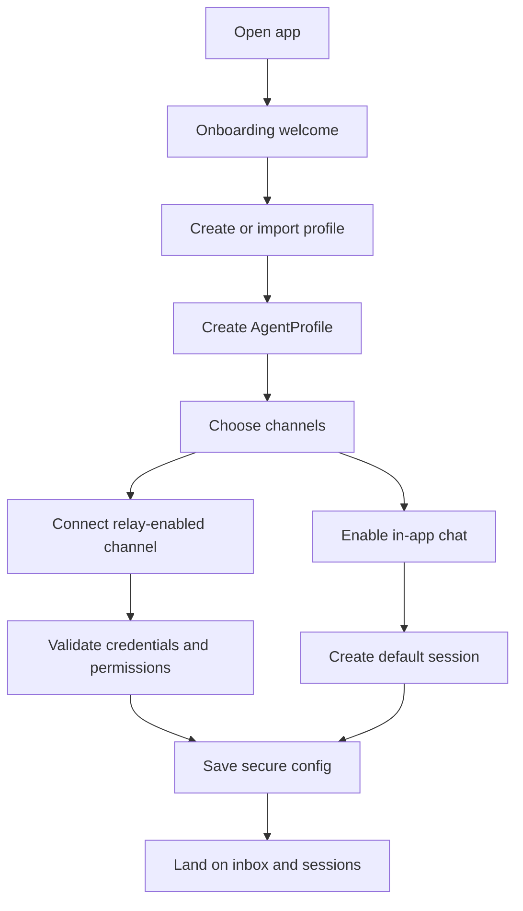
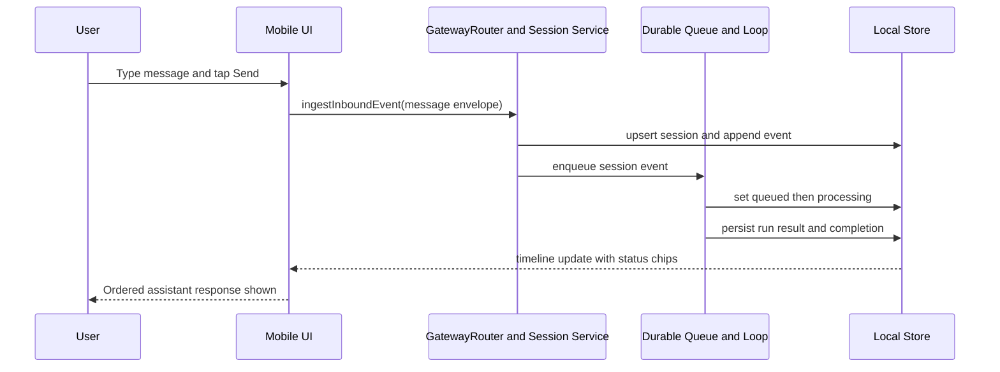
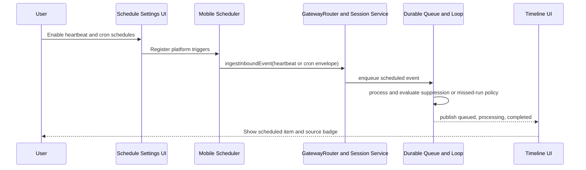
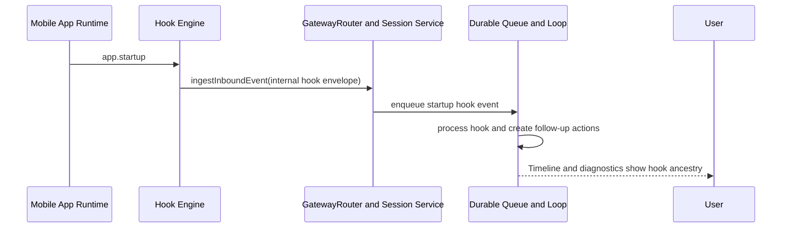
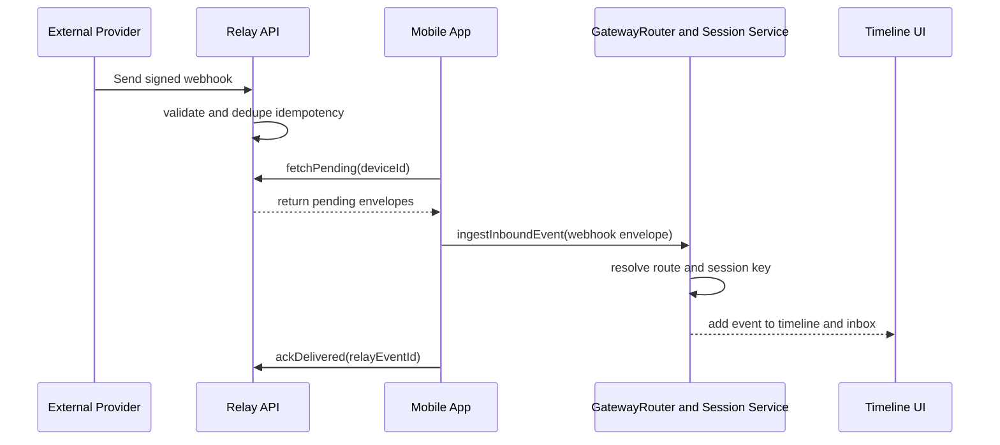
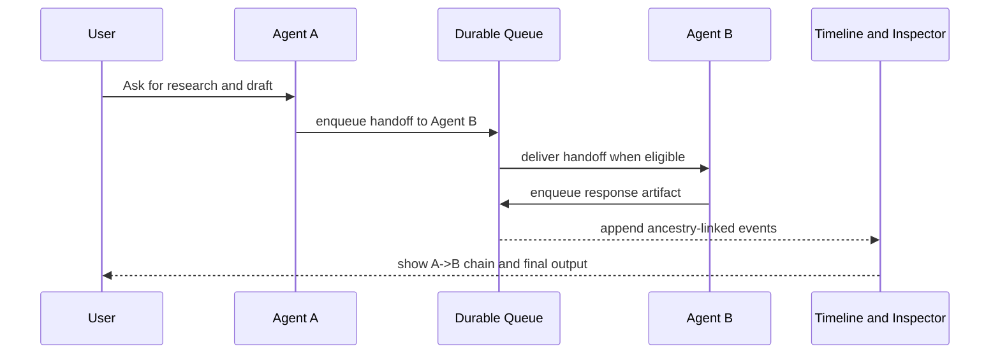
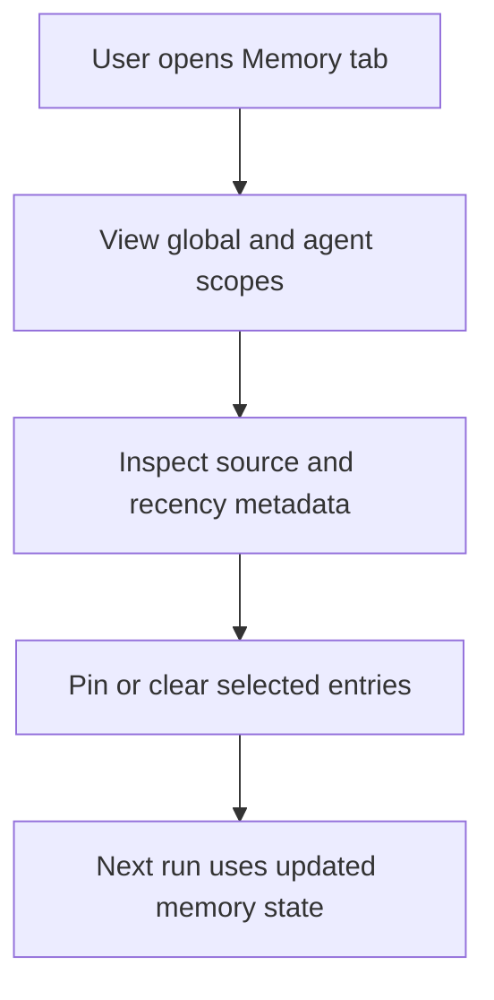
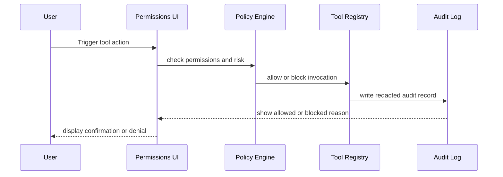
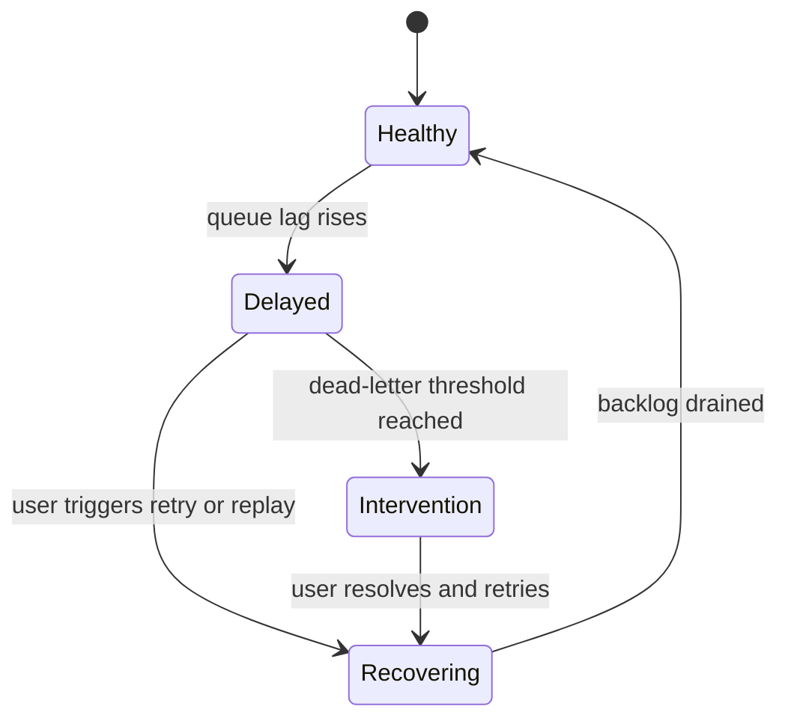

# Flutter OpenClaw Mobile User Interaction Flows

This document outlines how a user interacts with the app to use major OpenClaw-style features,
with Mermaid diagrams that map user actions to relay, routing, queue, memory, and tooling runtime
contracts from Milestones 1 to 12.

## 1) First run and agent setup flow

User goals:

- install app and complete onboarding
- create first agent profile
- connect at least one channel and local session
- enable runtime inputs (message, heartbeat, schedules)

Associated milestones: 1, 2, 3, 5, 6, 7.

## 2) Human message interaction flow

User goals:

- send a chat message
- see queued and processing states
- receive ordered response in the same session timeline

Associated milestones: 1, 3, 4, 5.

## 3) Heartbeat and cron scheduler interactions

User goals:

- configure periodic and calendar-based agent check-ins
- ensure scheduled events use same processing path as messages
- avoid noise with suppression and missed-run policies

Associated milestones: 6, 7, 4, 5.

## 4) Internal hook interactions

User goals:

- enable deterministic startup and lifecycle automation
- inspect hook-triggered events and downstream effects

Associated milestones: 8, 4, 5.

## 5) Webhook and relay interaction flow

User goals:

- connect external providers that can reach internet endpoints
- have events delivered safely to mobile via relay
- see events merged in session timeline with source metadata

Associated milestones: relay architecture, 9, 3, 4, 5.

## 6) Multi agent handoff interaction flow

User goals:

- run specialist agents for focused tasks
- keep memory and session boundaries clear
- inspect handoff lineage when results are produced

Associated milestones: 10, 11, 4.

### Practical mobile model

This can work on a phone if orchestration is asynchronous and queue-driven:

- handoffs are stored as normal events and processed by the same durable loop
- UI shows progress and can survive restarts
- allowlists bound fan-out and prevent runaway handoff loops
- heavy work can be deferred to relay-assisted or remote execution when needed

## 7) Memory and context interaction flow

User goals:

- review what memory is stored
- understand why context was used in a run
- clear or pin important memory entries

Associated milestones: 11, 5, 10.

## 8) Tooling and capability sandbox interactions

User goals:

- grant and revoke tool permissions
- confirm high-risk actions explicitly
- understand why a tool was allowed or blocked

Associated milestones: 12, 9, 11.

## 9) User visible runtime controls

The app should expose clear controls for key runtime operations:

- pause or resume processing loop
- retry failed queue items
- inspect dead-letter items and reason
- replay relay fetch on demand
- view per-session event ancestry and source type

Associated milestones: 4, 5, 9, 10, 12.

## 10) Feature map by user touchpoint and milestone

| Feature         | Primary user surface                      | Runtime components behind it                       | Main milestones |
| --------------- | ----------------------------------------- | -------------------------------------------------- | --------------- |
| Human chat      | Session timeline and composer             | Milestone 3 routing plus Milestone 4 queue         | 5, 3, 4         |
| Heartbeats      | Agent settings schedule panel             | Mobile scheduler plus shared ingestion path        | 6, 4, 5         |
| Cron schedules  | Schedule editor and diagnostics           | Trigger planner plus shared ingestion path         | 7, 4, 5         |
| Internal hooks  | Runtime automation settings and inspector | Hook engine plus queue and ancestry tracking       | 8, 4, 5         |
| Webhooks        | Integrations panel                        | Relay API plus Milestone 3 session routing         | 9, relay, 3     |
| Multi agent     | Agent workspace and handoff trace         | Routing allowlists plus queue-backed orchestration | 10, 4, 11       |
| Memory          | Memory inspector and controls             | Scoped storage plus compaction jobs                | 11              |
| Tooling sandbox | Permissions center and confirmations      | Policy engine plus tool registry and audit logs    | 12              |
| Diagnostics     | Inspector and status views                | Queue state, run results, relay delivery metadata  | 4, 9, 12        |

## 11) Cross milestone references

- Milestone 1 architecture mapping: `/experiments/plans/flutter-openclaw-m1-architecture-mapping`
- Milestone 2 domain model: `/experiments/plans/flutter-openclaw-m2-foundation-domain-model`
- Milestone 3 gateway and sessions: `/experiments/plans/flutter-openclaw-m3-gateway-router-sessions`
- Milestone 4 durable queue: `/experiments/plans/flutter-openclaw-m4-durable-queue-loop`
- Milestone 5 human message UX: `/experiments/plans/flutter-openclaw-m5-human-message-ux`
- Milestone 6 heartbeats: `/experiments/plans/flutter-openclaw-m6-heartbeats`
- Milestone 7 cron jobs: `/experiments/plans/flutter-openclaw-m7-cron-jobs`
- Milestone 8 internal hooks: `/experiments/plans/flutter-openclaw-m8-internal-hooks`
- Milestone 9 webhooks: `/experiments/plans/flutter-openclaw-m9-webhooks`
- Milestone 10 agent-to-agent messaging: `/experiments/plans/flutter-openclaw-m10-agent-to-agent`
- Milestone 11 memory and context: `/experiments/plans/flutter-openclaw-m11-memory-context`
- Milestone 12 tooling and capability sandbox: `/experiments/plans/flutter-openclaw-m12-tooling-sandbox`
- Relay architecture: `/experiments/plans/flutter-openclaw-relay-architecture`
