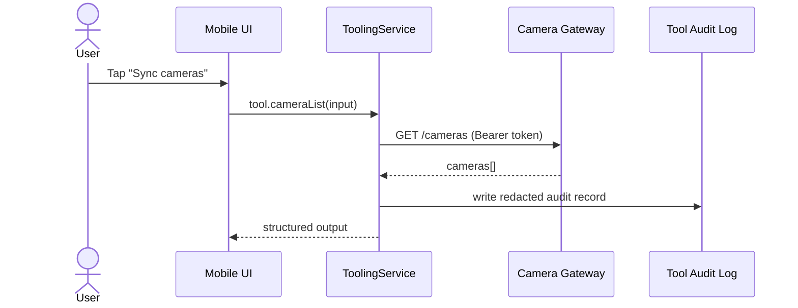
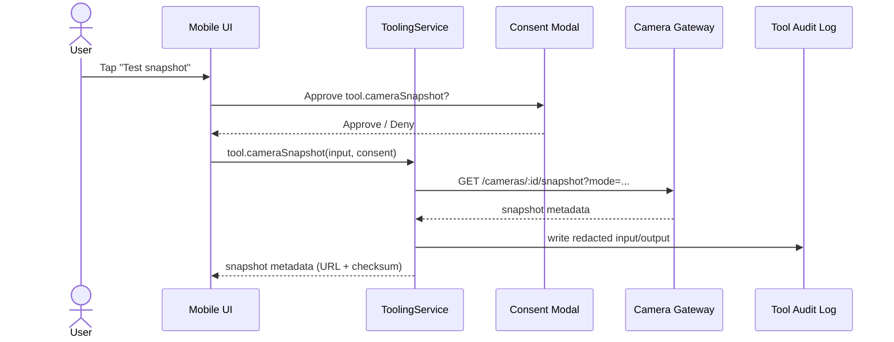

# Demo aged care Phase 2B camera tools

## Overview

Phase 2B adds camera gateway configuration and two camera tools to the OpenClaw mobile workbench. The implementation reuses the existing ToolRegistry and ToolingService policy pipeline, so camera requests are still default-deny, permission-gated, consent-gated (for medium risk), and audited.

## Gateway settings model and secure storage

- `CameraGatewaySettings` (global):
  - `baseUrl` (default `http://10.0.2.2:8799`)
  - `enabled` (boolean)
  - `tokenSet` (boolean UI hint only)
- Persisted in Drift `app_settings` table:
  - `camera_gateway_base_url`
  - `camera_gateway_enabled`
  - `camera_gateway_token_set`
- Raw token storage:
  - token is **not** stored in Drift
  - token is stored only in `flutter_secure_storage` via `SecretStore.saveCameraGatewayToken`

## Tool contracts and redaction

### tool.cameraList

- `toolId`: `tool.cameraList`
- risk: `low`
- permissions: `camera:list`
- input: `{ includeDisabled?: boolean }`
- output: `{ cameras: [{ cameraId, name, location, status, enabled }] }`

### tool.cameraSnapshot

- `toolId`: `tool.cameraSnapshot`
- risk: `medium`
- permissions: `camera:read`
- runtime consent required per existing M12 logic
- input: `{ cameraId: string, mode?: "latest" | "test_ok" | "test_fall" | "test_uncertain" }`
- output: `{ cameraId, capturedAt, snapshotUrl, checksum, quality, mode }`

### Redaction rules

- raw token is never logged and never included in audit fields
- keys containing `token`, `authorization`, or `secret` are stripped from audit fragments
- `tool.cameraSnapshot` audit output stores host+path form of URLs (query dropped)
- image bytes are never requested or stored in audit

## UI flow

- Added a **Cameras** section in workbench tooling card:
  - Gateway base URL + masked token input
  - Enable/disable gateway
  - Save settings action
  - Sync cameras button (invokes `tool.cameraList`)
  - Configured camera list (enable/disable/remove)
  - Test snapshot action (invokes `tool.cameraSnapshot` with selected mode)

Screenshots placeholder:
- `[TODO] Camera settings card screenshot`
- `[TODO] Sync cameras result screenshot`
- `[TODO] Snapshot consent + audit screenshot`

## Manual Android emulator validation

1. Start camera gateway:
   - `cd openclaw-camera-gateway`
   - `OPENCLAW_CAMERA_GATEWAY_TOKEN=demo-token npm start`
2. Launch app and open tooling section.
3. Set gateway base URL to `http://10.0.2.2:8799` and token `demo-token`, enable gateway, save.
4. Grant permissions for selected agent:
   - `camera:list`
   - `camera:read`
5. Run **Sync cameras** and verify camera entries populate.
6. Run **Test snapshot** in `test_ok` and `test_fall` modes.
7. Confirm snapshot call shows consent modal.
8. Confirm recent tool audit entries include allow/deny reasons and consent outcomes.
9. Confirm no raw token appears in UI audit fragments.
