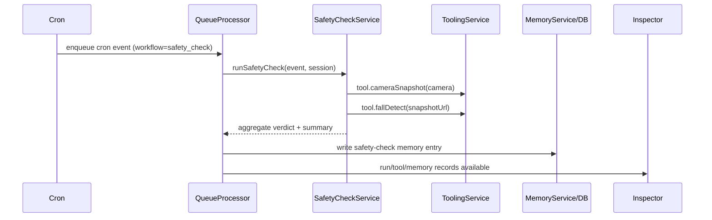
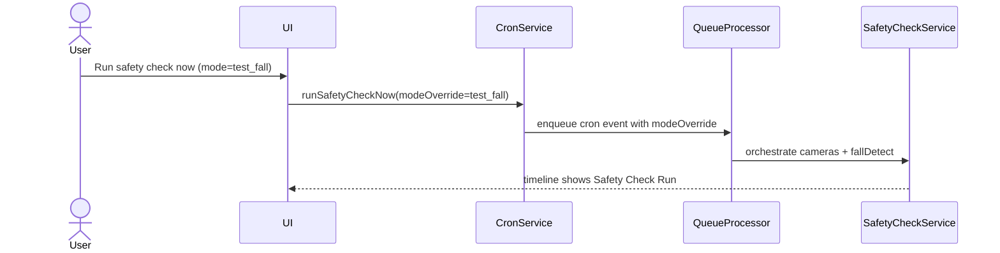

# Demo aged care Phase 2C safety check orchestration

## Event payload contract

Phase 2C reuses `EventType.cron` with an explicit workflow marker in payload:

```json
{
  "workflow": "safety_check",
  "scheduleId": "safety-check-...",
  "modeOverride": "test_ok|test_fall|test_uncertain|latest",
  "toolConsentApproved": true
}
```

`modeOverride` is optional and is used for deterministic demos.

## Orchestration and idempotency strategy

Safety checks run through the existing queue path:

1. Cron (or manual run helper) enqueues a cron event with `workflow=safety_check`.
2. `QueueProcessor` detects this workflow and delegates to `SafetyCheckService`.
3. `SafetyCheckService` iterates enabled `configured_cameras`.
4. For each camera:
   - invoke `tool.cameraSnapshot`
   - invoke `tool.fallDetect`
5. Aggregate per-camera findings into overall verdict.
6. Persist run result + memory writes + tool audits.

Idempotency:
- scheduled runs: existing `cron-<scheduleId>-<minuteBucket>` key
- manual runs: `safety-manual-<sessionId>-<mode>-<minuteBucket>` key

## fallDetect stub behavior

`tool.fallDetect` is deterministic in Phase 2C:
- `snapshotUrl` contains `fall` -> `fall_suspected` (`0.92`)
- `snapshotUrl` contains `uncertain` -> `uncertain` (`0.55`)
- otherwise -> `ok` (`0.90`)

This is a placeholder that will be replaced by real inference later.

## Memory usage and provenance

Phase 2C writes a structured session-scoped memory entry for each safety check run containing:
- overall verdict
- per-camera findings (`cameraId`, `verdict`, `confidence`, `checksumPrefix`, `capturedAt`)
- timestamp and summary

Provenance fields are populated via existing memory pipeline:
- `sourceEventId`
- `sourceRunId`
- `sourceAgentId`
- `sourceSessionId`
- optional ancestry fields (`sourceRootEventId`, `sourceHandoffTraceId`)

## Mermaid diagrams





## Manual Android emulator validation

1. Start gateway:
   - `cd openclaw-camera-gateway`
   - `OPENCLAW_CAMERA_GATEWAY_TOKEN=demo-token npm start`
2. Launch app and configure camera gateway:
   - base URL `http://10.0.2.2:8799`
   - token `demo-token`
3. Sync cameras and enable at least one configured camera.
4. Grant tool permissions for the active agent:
   - `camera:list`
   - `camera:read`
   - `safety:detect`
5. Run **Run safety check now** in `test_ok` mode, then `test_fall` mode.
6. Open inspector for each safety-check timeline event and verify:
   - tool chain includes `tool.cameraSnapshot` + `tool.fallDetect`
   - memory write exists with structured safety-check content
   - audit entries remain redacted (no token, no image bytes).
