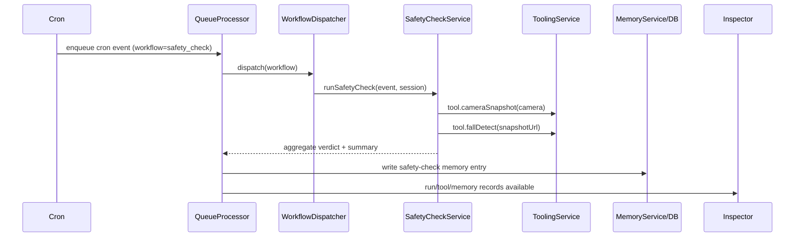
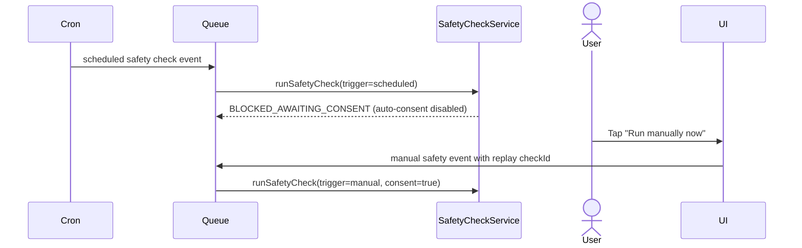

# Demo aged care Phase 2C safety check orchestration

## Event payload contract

Phase 2C reuses `EventType.cron` with an explicit workflow marker in payload:

```json
{
  "workflow": "safety_check",
  "trigger": "scheduled|manual",
  "scheduleId": "safety-check-...",
  "checkId": "check:<scheduleId>:<mode>:<minuteBucket>",
  "modeOverride": "test_ok|test_fall|test_uncertain|latest",
  "toolConsentApproved": true
}
```

## Consent policy for scheduled and manual runs

- Manual safety check runs can use interactive consent and set `toolConsentApproved=true`.
- Scheduled runs never trigger UI modals.
- Per-agent setting: `safetyCheckAutoConsentEnabled` (default `false`).
  - `false`: scheduled safety check produces `BLOCKED_AWAITING_CONSENT` outcome and completes without tool execution.
  - `true`: medium-risk safety tools are auto-approved for consent only (permissions still required).
- Audit semantics:
  - manual approved: `permission granted + runtime consent approved`
  - scheduled auto-approved: `auto_approved_by_setting`
  - blocked: no tool execution records for that check.

## Orchestration and idempotency strategy

Safety checks run through the existing queue path:

1. Cron (or manual run helper) enqueues a cron event with `workflow=safety_check`.
2. `QueueProcessor` sends workflow events to a `WorkflowDispatcher`.
3. `WorkflowDispatcher` routes `safety_check` to `SafetyCheckService`.
4. `SafetyCheckService` iterates enabled `configured_cameras`.
5. For each camera:
   - invoke `tool.cameraSnapshot` with idempotency `safety:<checkId>:<cameraId>:snapshot`
   - invoke `tool.fallDetect` with idempotency `safety:<checkId>:<cameraId>:detect`
6. Aggregate per-camera findings into overall verdict and summary.
7. Persist run result + memory writes + tool audits.

Idempotency:
- scheduled runs: `checkId` derived from `scheduleId + mode + minute bucket`
- manual runs: `checkId` derived from `safety-manual + mode + minute bucket` or explicit replay `checkId`

## fallDetect stub behavior

`tool.fallDetect` is deterministic in Phase 2C:
- `snapshotUrl` contains `fall` -> `fall_suspected` (`0.92`)
- `snapshotUrl` contains `uncertain` -> `uncertain` (`0.55`)
- otherwise -> `ok` (`0.90`)

This is a placeholder that will be replaced by real inference later.

## Per-camera failure handling rules

Each camera always produces a finding:
- `status`: `ok|uncertain|fall_suspected|error`
- `errorType`: `offline|unauthorized|timeout|http_error|unknown` when status is `error`
- `errorMessage`: short safe message (no token/secret)

Overall verdict:
- any `fall_suspected` => `fall_suspected`
- else any `uncertain` or any `error` => `uncertain`
- else `ok`

## Memory usage and provenance

Phase 2C writes a structured session-scoped memory entry for each safety check run containing:
- `checkId`, `trigger`, `mode`, `autoConsentUsed`
- overall verdict
- per-camera findings (`cameraId`, `status`, `verdict`, `confidence`, `checksumPrefix`, `capturedAt`, error fields)
- top-level summary and timestamp

Provenance fields are populated via existing memory pipeline:
- `sourceEventId`
- `sourceRunId`
- `sourceAgentId`
- `sourceSessionId`
- optional ancestry fields (`sourceRootEventId`, `sourceHandoffTraceId`)

## Mermaid diagrams





## Manual Android emulator validation

1. Start gateway:
   - `cd openclaw-camera-gateway`
   - `OPENCLAW_CAMERA_GATEWAY_TOKEN=demo-token npm start`
2. Launch app and configure camera gateway:
   - base URL `http://10.0.2.2:8799`
   - token `demo-token`
3. Sync cameras and enable at least one configured camera.
4. Grant tool permissions for the active agent:
   - `camera:list`
   - `camera:read`
   - `safety:detect`
5. With auto-consent toggle OFF:
   - wait for scheduled check (or run schedule now)
   - verify timeline shows blocked awaiting consent
   - tap **Run manually now** and verify check executes
6. With auto-consent toggle ON:
   - trigger scheduled run
   - verify tools execute without modal
   - verify audit reason includes `auto_approved_by_setting`
7. Open inspector for safety-check events and verify:
   - trigger type (`scheduled` or `manual`) and checkId context
   - tool chain includes `tool.cameraSnapshot` + `tool.fallDetect`
   - memory write contains structured findings and any errors
   - audit entries remain redacted (no token, no image bytes).
