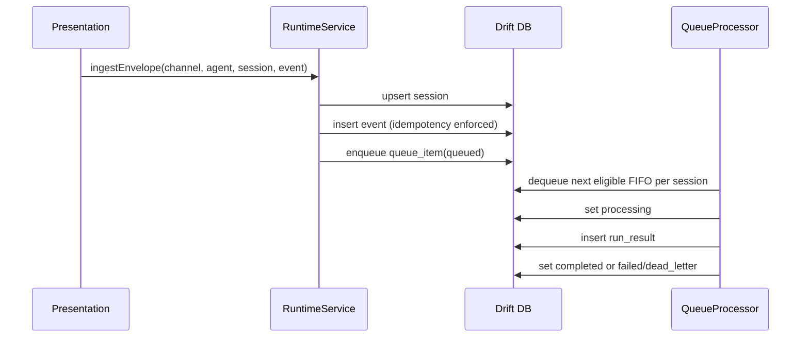
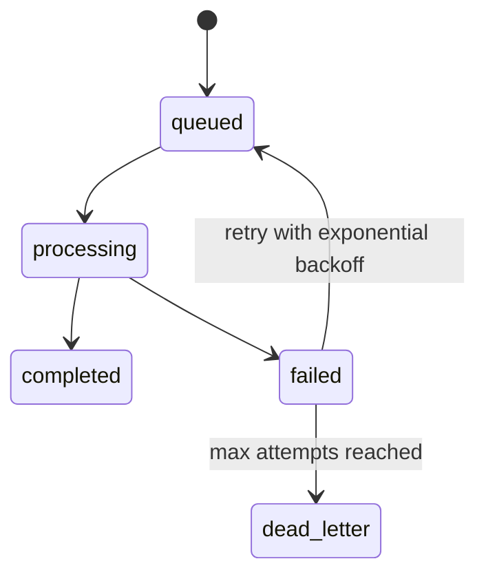
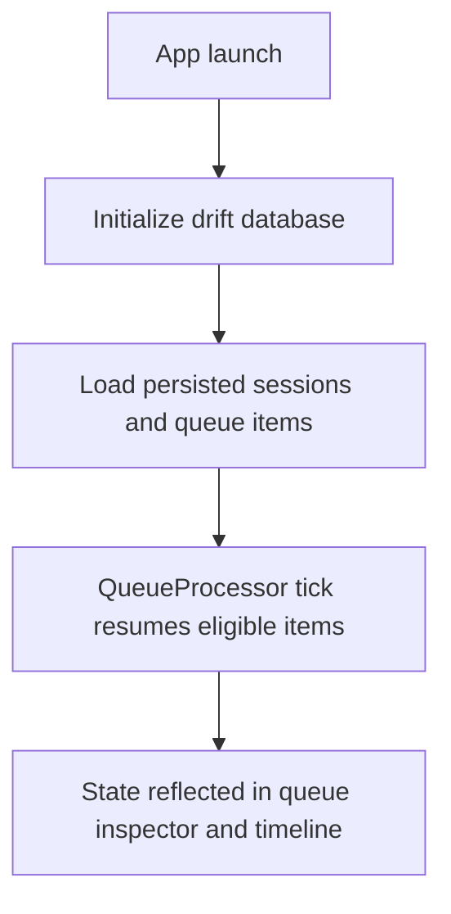
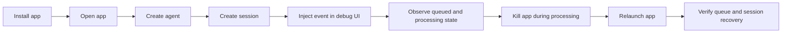

# Flutter OpenClaw Mobile Milestones 1-4 Architecture and Implementation

## Scope

This document covers implementation of Milestones 1 to 4 for the Flutter OpenClaw mobile subproject
located at `/openclaw-mobile`.

Implemented scope:

- Milestone 1: architecture mapping and platform constraints
- Milestone 2: foundation and domain model
- Milestone 3: gateway and session routing
- Milestone 4: durable queue and processing loop

Out of scope in this phase:

- heartbeats, cron, hooks, webhooks, multi-agent orchestration, tooling sandbox, security hardening

## Runtime architecture mapping

The mobile runtime is split into layers:

- `presentation`: Flutter UI and debug workbench
- `application`: gateway routing, runtime ingestion, queue processor
- `domain`: versioned entities and event types
- `infrastructure`: drift-backed persistence and secure storage wrapper

All runtime control state is on-device in this phase:

- agents and sessions
- queue lifecycle and retry state
- event history and run results

Model execution is a stub in this phase, with architecture designed so provider calls can be remote
while orchestration remains local.

## Event lifecycle mapping

## Queue lifecycle

## Session boundary model

- Session is keyed by `sessionId` and associated with `(agentId, channelId)`.
- Queue processing enforces no parallel `processing` items in the same session.
- Per-session FIFO is achieved by selecting oldest eligible queue item and gating while one item is
  already processing in that session.

## App restart recovery

## Flutter platform constraints

## iOS

- background execution windows are limited and non-deterministic
- long-running loops cannot be assumed to stay alive
- queue must persist frequently and resume on relaunch

## Android

- WorkManager/background constraints vary by OEM battery policy
- foreground/background transitions may interrupt processing
- persistent queue and replayable processing are required

## Notifications and scheduling limits

- this phase does not implement scheduler sources
- future scheduler/webhook packages must enqueue through same local queue abstraction

## Primary user journey (M1-M4)

## Implemented versus designed (M1-M4)

- Implemented: layered app skeleton, versioned entities, drift persistence, gateway routing,
  idempotency, durable queue states, retry and dead-letter, debug UI, tests.
- Designed but deferred: real model providers, push/webhook relay wiring, background schedulers,
  advanced observability UX.

Design deviation notes:

- Drift is used with raw SQL statements to avoid code generation overhead in this initial milestone
  slice.
- Processing loop is manually ticked from UI for deterministic debug/testing in M1-M4.

## Manual Android test plan

1. Build APK in `openclaw-mobile` (`flutter build apk`).
2. Install on Android device (`flutter install` or adb install).
3. Launch app and create a session in the workbench.
4. Inject event and observe queue state.
5. Process event and verify transition to `completed`.
6. Inject a failure event and process until dead-letter.
7. Kill app during queued/processing state.
8. Relaunch app and verify queue/session state persisted.
9. Capture and export logs/screenshots for milestone evidence.

## Test mapping

- Unit tests: serialization, schema version, gateway routing, idempotency, queue transitions.
- Integration tests: ingest -> queue -> process -> persisted result.
- Failure tests: forced processor failure and dead-letter transition.

## Milestone 5 implementation follow-up

- Human messages implementation details: `/flutter-openclaw-mobile/m5-human-messages-implementation`
