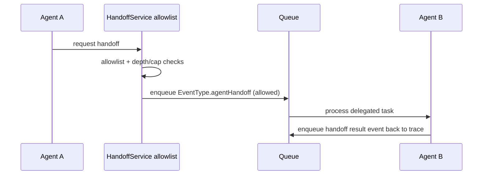
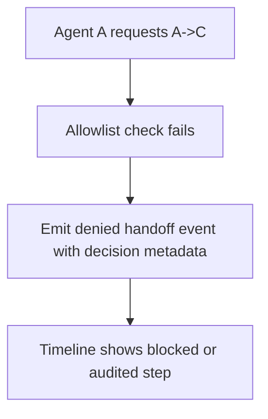
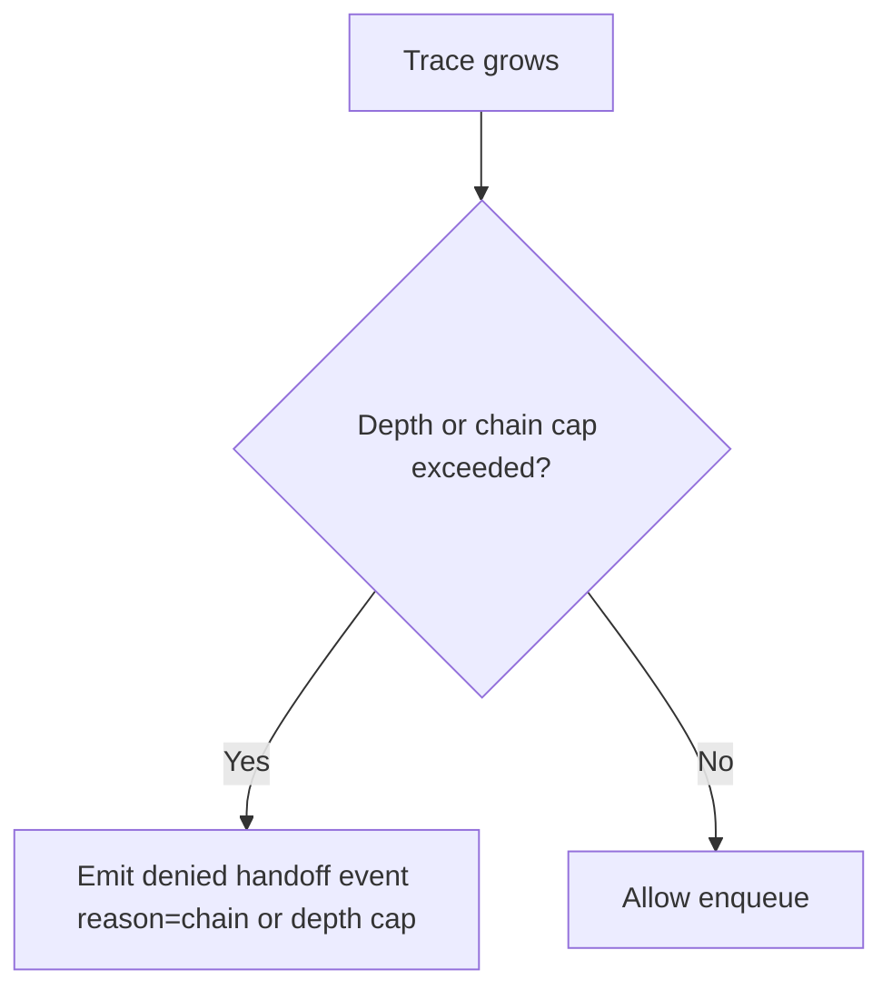
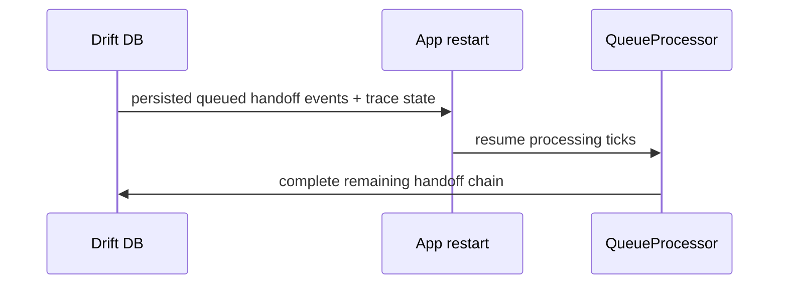

# Flutter OpenClaw Mobile Milestone 10 Agent-to-agent messaging

## Scope

Milestone 10 introduces agent handoffs as first-class queue events.

- Handoffs are persisted as `EventType.agentHandoff` events.
- No side channel orchestration engine is introduced.
- Handoff traces are durable and resumable after restart.

## Handoff contract

`EventType.agentHandoff` payload includes:

- `fromAgentId`
- `toAgentId`
- `handoffReason`
- `taskPayload`
- `handoffTraceId`
- `decision` metadata (`allowed`, `reason`, approval flags)
- ancestry metadata (`rootEventId`, `parentEventId`, `depth`, `orderKey`)

## Allowlist and decision metadata

- Deny-by-default model.
- Per-source agent allowlist (`allowedTargets`) controls permitted targets.
- High-risk approval gate is represented as config and decision metadata in v1.
- Denied routes are still recorded as handoff events for auditability.

## Loop prevention and caps

- Depth cap via handoff settings.
- Chain cap per trace (`maxDepth`) and active concurrent chain cap (`maxConcurrentChains`).
- Paused trace blocks new handoff enqueues for that trace.

## Pause and resume semantics

- Trace state is persisted in `handoff_traces` with `paused` flag.
- UI trace inspector allows toggling pause/resume per trace.
- While paused, additional handoffs for that trace are denied and audited.

## Return model

Approach B is implemented:

- Agent B handoff completion emits a **handoff result event** back toward Agent A in the same trace.
- Trace continuity is preserved with `handoffTraceId` + ancestry metadata.

## Mermaid diagrams

### A) A delegates to B with allowlist gate

### B) Denied route audited

### C) Cycle or depth cap prevention

### D) Restart recovery

## Implemented vs designed

Implemented:

- First-class handoff event contract and trace metadata.
- Allowlist deny-by-default with per-agent target toggles.
- Pause/resume trace support and trace inspector list.
- Demo path: Research agent to Writer agent.

Deviations:

- High-risk user approval is config and decision-metadata only in v1.
- Cycle control is achieved through chain/depth caps rather than full graph cycle analysis.

## Manual Android test plan

1. Create two agents and one shared session.
2. In handoff allowlist, enable Agent A -> Agent B.
3. Run the demo button (Research -> Writer).
4. Verify timeline shows handoff event and result event with trace metadata.
5. Disable allowlist route and run again; verify denied audited event appears.
6. Pause a trace in trace inspector and attempt another handoff in same trace; verify denied due to paused trace.
7. Kill app mid-chain and relaunch; run processing and verify queued handoff chain resumes.
