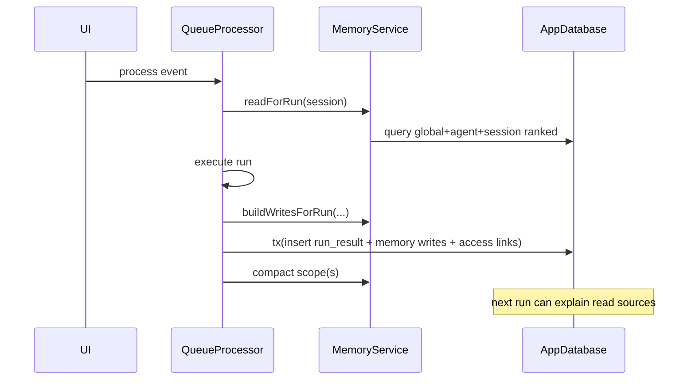
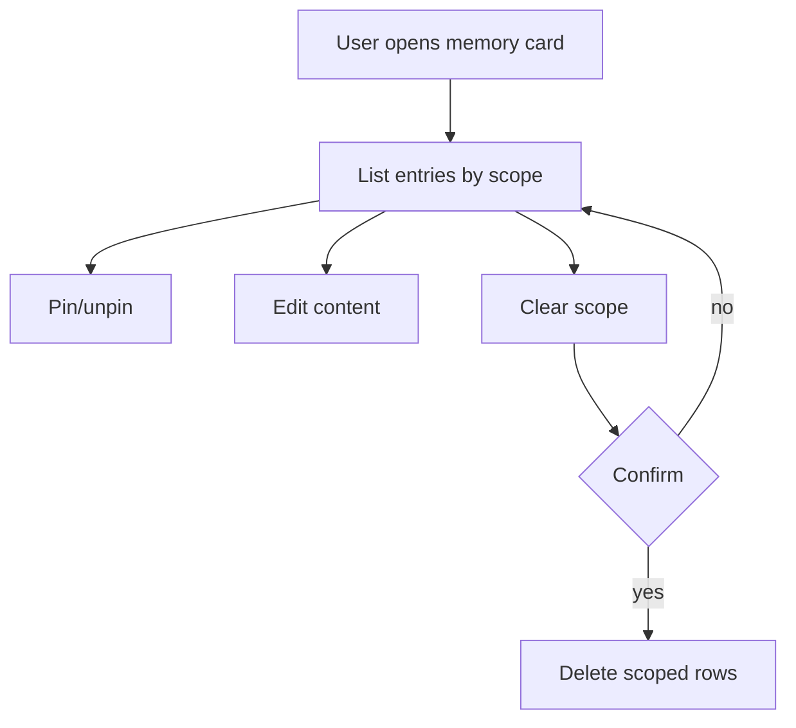

# Milestone 11: Memory and Context

This milestone adds durable memory scopes and retrieval/compaction logic to `openclaw-mobile`, reusing the same app database and queue/run pipeline.

## Scope model

Memory entries are stored in `memory_entries` with these scopes:

- `global`: user-level preferences and long-lived guidance.
- `agent`: per-agent working memory.
- `session`: per-session execution history and summaries.

Each entry tracks provenance and ranking fields:

- provenance: `sourceEventId`, `sourceRunId`, `sourceAgentId`, `sourceSessionId`, `sourceHandoffTraceId`, `sourceRootEventId`
- recency: `createdAt`, `updatedAt`, `lastAccessedAt`
- ranking: `pinned`, `importance`

## Retrieval and write path

- Before each run, `MemoryService.readForRun()` fetches ranked memory from global+agent+session scopes.
- After run completion, queue processing persists `RunResult` and memory writes together using a DB transaction (`insertRunResultWithMemory`) and records read/write diagnostics in `run_memory_accesses`.
- Agent handoff chains carry trace/root metadata into memory provenance so downstream runs can inspect origin.

## Compaction strategy and budgets

Compaction is best-effort and additive:

- Retrieval budget: max 24 entries, ~4000 characters.
- Per-scope compaction trigger: ~12000 characters.
- Compaction output is a `summary` entry that references source entry IDs.
- Raw entries are retained (no destructive compaction in v1), so compaction failure cannot lose source facts.

## Recovery and durability

Memory retrieval uses persisted ranking fields in SQLite (no full re-indexing required on restart). After restart, entries remain retrievable through the same ranked queries.

## UX

Workbench adds a **Memory** card with:

- inspect by scope (global, agent, session)
- provenance line (`event/run/trace`)
- pin/unpin
- edit
- clear by scope with confirmation

Timeline cards include a per-event memory diagnostics line (`reads/writes`).

## Implemented vs designed

- Implemented: scoped durable memory, ranked retrieval, atomic run-result + memory writes, additive compaction, provenance links, scope edit/pin/clear UI.
- Deviation: compaction currently uses deterministic text-length budgets and summarization by concatenation (no LLM summarizer yet).

## Mermaid diagrams

### Run + memory lifecycle



### Handoff provenance into memory

```mermaid
flowchart LR
  E[Handoff Event]\n(rootEventId, handoffTraceId) --> R[RunResult]
  R --> W[Memory write]
  W --> P[(sourceRootEventId\nsourceHandoffTraceId)]
```

### Pin / edit / clear



## Manual Android validation

1. Create an agent + session and send messages; process queue.
2. Open Memory card and verify session/agent entries appear with provenance.
3. Restart app and verify entries still appear and are reused in later runs.
4. Pin/unpin and edit entries in global/agent scopes.
5. Clear each scope and verify only that scope is deleted.
6. Trigger compaction (toolbar “Compact memory now”) after generating many entries; verify summary appears while raw entries remain.
