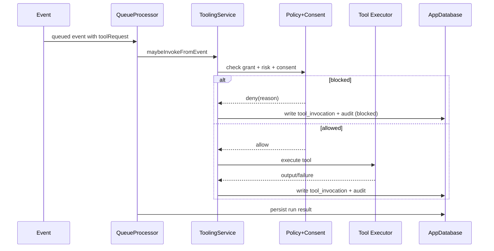

# Milestone 12: Tooling Layer and Capability Sandbox

Milestone 12 adds a tool registry, permission and consent gating, and auditable tool invocations to the existing OpenClaw mobile queue/runtime path.

## ToolRegistry contract

The app introduces a `ToolRegistry` where every tool defines:

- `toolId` (stable id)
- `capabilityCategory`
- `requiredPermissions`
- `riskLevel` (`low`, `medium`, `high`)
- `inputSchema` and `outputSchema` metadata

Implemented example tools:

- `tool.echo` (low)
- `tool.httpGet` (medium, network required)
- `tool.openUrl` (high, blocked in the mobile sandbox and marked deferred/not supported)

## Permission and consent model

- Default deny for all tools unless explicitly granted.
- Policy check runs before execution.
- Medium and high risk tools require runtime consent.
- Incompatible mobile operations are denied with explicit reasons.

Persistence choice:

- Per-agent grants are stored in `tool_permissions`.
- Invocation and audit records are stored in `tool_invocations` and `tool_audit_logs`.

## Audit and explainability

Each tool call writes an audit record containing:

- requester identity (`agentId`, `sessionId`, `eventId`, optional `handoffTraceId`, `rootEventId`)
- `toolId`
- decision (`allowed` or `blocked`) and reason
- consent outcome (`approved`, `denied`, or `not_required`)
- invocation outcome (`success`, `failure`, or `blocked`)
- redacted input/output fragments

UI shows “why allowed” or “why blocked” in timeline diagnostics and audit list.

## Mobile constraints and fallback

- `tool.openUrl` is blocked with a clear sandbox message (deferred/not supported in v1).
- `tool.httpGet` reports explicit offline fallback when network is unavailable.
- Long-running background-style operations are intentionally not executed as persistent workers in v1.

## Integration with runtime

Tool requests are embedded in event payload (`toolRequest`) and execute through the existing queue processing path:

1. event dequeued
2. tool policy + consent gate
3. tool execution (if allowed)
4. invocation + audit persistence
5. run result persistence

Idempotency is enforced with `(event_id, tool_id, idempotency_key)` uniqueness to prevent duplicate execution.

## Mermaid

## Implemented vs designed

- Implemented: registry contract, safe default deny, per-agent grants, runtime consent gate, auditable redacted logs, idempotent invocation keys, and UI for registry/permissions/audit visibility.
- Deviation: high-risk `openUrl` remains intentionally blocked in the v1 mobile sandbox instead of launching external apps.

## Manual Android validation plan

1. Select an agent/session and run a tool without grant (expect blocked + reason).
2. Grant permission in Tools card and run again.
3. Run `tool.httpGet` and validate consent modal appears.
4. Run `tool.openUrl` with approval and verify sandbox block reason is logged.
5. Open audit entries and verify redacted input/output fragments.
6. Disable network (or use offline emulator/device mode), run `tool.httpGet`, verify offline fallback message.
