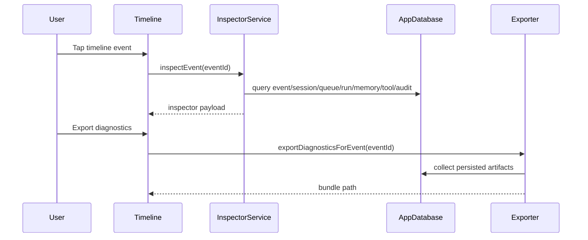
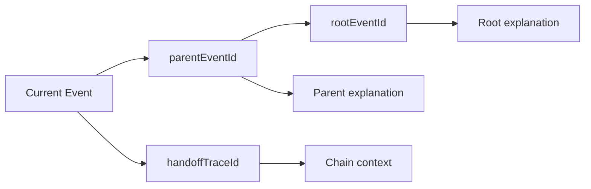

# Milestone 14: UX, Observability, and Explainability

Milestone 14 adds a first-class Event Inspector and diagnostics export path to the mobile workbench, built from persisted runtime facts in the app DB.

## Inspector UI overview

Timeline items now include an **Inspect** action.

The inspector shows:

1. Identity and source
   - event id, agent id, session id, channel id
   - event type label and source metadata
2. Queue and lifecycle
   - current queue state, attempts, timestamps, idempotency key
3. Execution trace
   - deterministic step list synthesized from persisted records
4. Memory reads and writes
   - scoped entries with provenance snippets
5. Tool decisions
   - allow/deny reason, consent outcome, redacted fragments, audit id
6. Why did this happen
   - ancestry chain using `rootEventId`, `parentEventId`, `depth`, `handoffTraceId`

_Screenshot placeholder_: inspector dialog opened from a timeline card.

## Data sources

Inspector sections are assembled by `InspectorService` from:

- `events`
- `sessions`
- `queue_items`
- `run_results`
- `run_memory_accesses` + `memory_entries`
- `tool_audit_logs`
- `handoff_traces` (when a trace id is present)

No new runtime-only trace channel is required; trace steps are synthesized from persisted facts.

## Why did this happen panel

The ancestry panel traverses from current event to parent/root and renders a clickable-style chain (`Root -> ... -> Parent -> Current`) with context strings.

Examples:

- `Triggered by webhook delivery <relayEventId>`
- `Created by turnStart hook for event <parentEventId>`
- `Agent A delegated to Agent B (trace <handoffTraceId>)`

When no ancestry metadata exists, the inspector shows: `No ancestry metadata recorded`.

## Diagnostics export

Inspector offers **Export diagnostics** for a single event.

Current export target:

- writes a directory bundle to app temp storage and shows its path.

Bundle contents:

- `metadata.json`
- `event.json`
- `session.json`
- `queue.json`
- `run_results.json`
- `memory_reads.json`
- `memory_writes.json`
- `tool_audits.json`
- `ancestry.json`
- `handoff_trace.json` (if applicable)
- `README.md`

Redaction rules:

- secret-like keys (`token`, `secret`, `password`, `apikey`, `bearer`) are replaced with `[REDACTED]`
- bearer-token style strings are scrubbed
- tool audit I/O remains redacted fragments

## Timeline demo UX polish

Added filters and controls:

- filter by event type
- filter by queue state
- filter by trace id substring
- sort newest-first toggle
- show-only-this-session toggle

These controls keep the timeline demo usable when multiple event sources are active.

## Mermaid diagrams

### Inspector load and export

### Why did this happen traversal

## Implemented vs designed

- Implemented: event inspector, ancestry explanations, deterministic trace synthesis, diagnostics export bundle, and timeline filters/sort.
- Deviation: export currently creates a directory bundle (not zip) for simplicity and deterministic tests.

## Manual Android validation plan

1. Generate events for human, heartbeat, cron, internal hook, webhook, and handoff.
2. Open inspector for each timeline entry and verify identity/source/lifecycle sections.
3. Run tool allow/deny flows and verify policy reasons + consent outcomes are visible.
4. Verify memory reads/writes appear with scope and provenance snippets.
5. Export diagnostics from inspector and verify bundle path is shown.
6. Inspect exported files and confirm redaction rules are applied.
