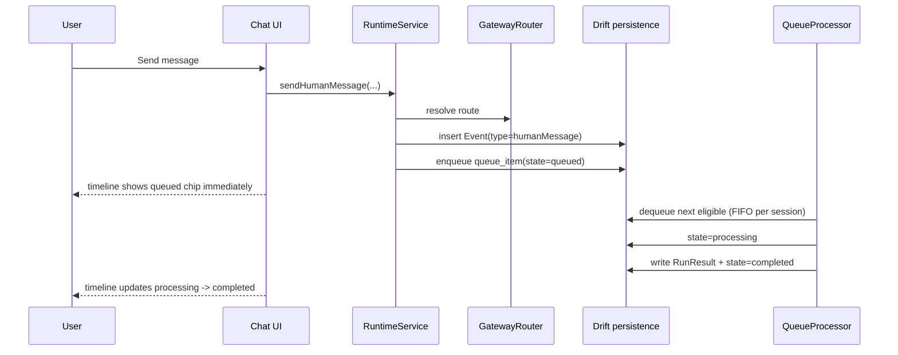
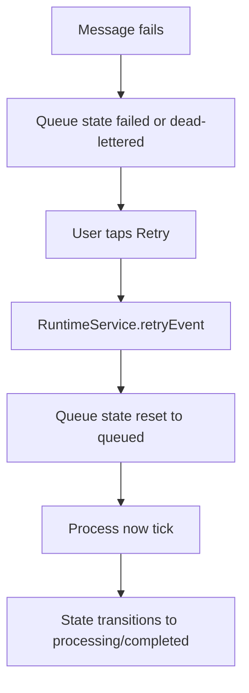

# Flutter OpenClaw Mobile Milestone 5 Human Messages Implementation

## Scope

This document describes Milestone 5 implementation in `openclaw-mobile`:

- user-facing chat experience (agent/session selection, timeline, composer)
- human message ingestion through gateway and durable queue
- queue lifecycle status chips in timeline
- retry action for failed or dead-lettered messages

Milestones 6+ are intentionally out of scope.

## Implemented UX

- Agent selector with create-agent action
- Session selector with create-session action
- Chat timeline rendering per selected session
- Message composer and send button
- Per-event status chips: queued, processing, completed, failed, dead-lettered
- Retry action on failed/dead-lettered timeline entries
- Temporary `Process now` control (manual tick) for deterministic milestone validation

## Event pipeline and queue flow

## Retry flow

## User flow

## Ordering and non-interleaving behavior

- Messages are inserted as ordered events by created timestamp.
- Queue dequeue query prevents concurrent `processing` items in the same session.
- Rapid sends remain queued and are processed serially per session.

## Implemented versus designed

Implemented in milestone 5:

- human-message event type (`EventType.humanMessage`)
- user-facing chat workflow (not debug-only controls)
- status-chip mapping based on durable queue state
- retry action for failed/dead-letter states
- tests for ordering, no interleaving, idempotency rejection, retry state mapping

Designed but deferred:

- always-on background processing loop
- provider-backed assistant response generation in timeline
- push/scheduler-triggered processing (Milestones 6+)

Deviation rationale:

- `Process now` is retained temporarily to avoid fake background guarantees in local development and to
  keep Milestone 5 deterministic; later milestones replace this with scheduler/background execution.

## Manual Android test plan (Milestone 5)

1. Build and install app (`flutter build apk`, then install).
2. Open app and create/select an agent.
3. Create/select a session.
4. Send three messages rapidly from composer.
5. Verify timeline shows all three immediately as queued.
6. Trigger `Process now` repeatedly and verify ordered completion.
7. Inject a failure event (debug path or forced failure payload) and process.
8. Verify failed/dead-letter chip appears, tap retry, then process again.
9. Verify state transitions reflect retry path.

## Test coverage summary

- unit: status-chip mapping labels
- integration: rapid sends ordering, no interleaving, idempotency rejection
- failure: retry action changes state from failed/dead-letter to queued

## Next milestone

- Milestone 6 heartbeat implementation: /flutter-openclaw-mobile/m6-heartbeats-implementation
