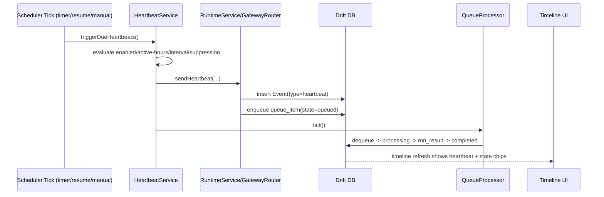
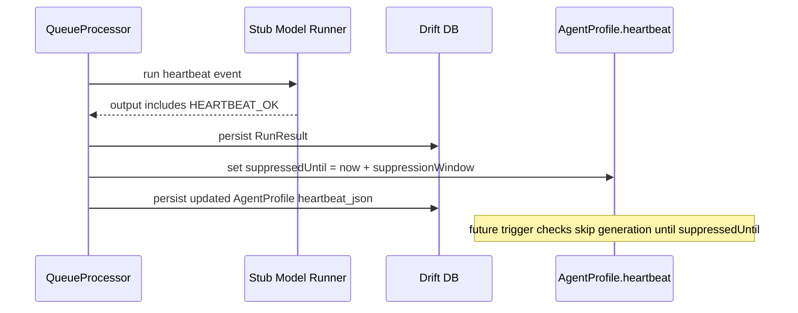
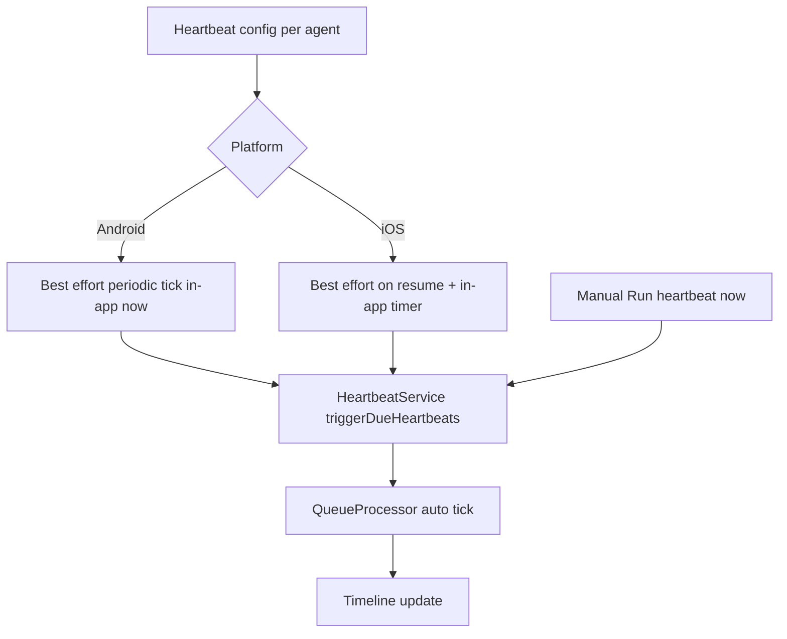

# Flutter OpenClaw Mobile — Milestone 6 (Heartbeats)

## Scope

Milestone 6 adds **Input type 2: heartbeat** on top of the Milestone 1-5 foundation.
Heartbeats are generated into the same runtime path as human messages:
GatewayRouter -> durable queue -> processing loop -> run result persistence -> timeline UI.

## Architecture updates

- `AgentProfile` now includes schema-versioned `HeartbeatSettings` (enabled flag, interval, active-hours window, prompt template, last fired time, suppression metadata).
- Heartbeat generation is handled by `HeartbeatService` in the application layer.
- Heartbeat events are persisted as `EventType.heartbeat` with source metadata and idempotency keys.
- Suppression token behavior is implemented in the queue processor:
  - if a heartbeat run output contains `HEARTBEAT_OK`, further heartbeats are suppressed.
  - suppression is persisted in agent heartbeat settings.
  - suppression window: **120 minutes default** (long enough to reduce noise while still allowing same-day follow-up checks).
- Scheduling is best-effort in this milestone:
  - foreground periodic timer (1 minute)
  - app resume trigger
  - manual "Run heartbeat now" for deterministic testing

## Mermaid diagrams

### A) Heartbeat trigger to UI update

### B) Suppression token flow

### C) Platform scheduling overview

## Platform reliability notes (Milestone 6)

- **Android**: current implementation is in-app best-effort. A native WorkManager bridge is planned for later milestones.
- **iOS**: current implementation is best-effort only; heartbeat checks run when app is active/resumed. BGTask integration is deferred.
- Because both are best-effort in this phase, the manual trigger is kept for operator testing.

## Implemented vs Designed

- Implemented:
  - schema-versioned heartbeat config persisted per agent
  - deterministic schedule decision logic
  - suppression token persistence across app restart
  - heartbeat events visible in chat timeline with queue lifecycle chips
  - automatic processing tick attempt after heartbeat generation
- Deviation:
  - native Android WorkManager and iOS BGTask are not yet wired in milestone 6; replaced by in-app timer+resume strategy.

## Manual Android test plan (Milestone 6)

1. Build and install debug/release app.
2. Create/select an agent and session.
3. Open heartbeat settings:
   - enable heartbeat
   - set interval to 5-10 minutes
   - keep active hours including current time
4. Trigger `Run heartbeat now` and verify timeline shows a heartbeat message.
5. Verify heartbeat enters `queued` then transitions through processing/completed states.
6. Verify output includes suppression token path and future triggers are skipped while suppression window is active.
7. Kill app mid-processing, relaunch, and verify queue state and suppression metadata persist.
8. Use `Process now` only as fallback when background processing does not progress automatically.

## Next milestone

- Milestone 7 cron jobs implementation: /flutter-openclaw-mobile/m7-cron-jobs-implementation
