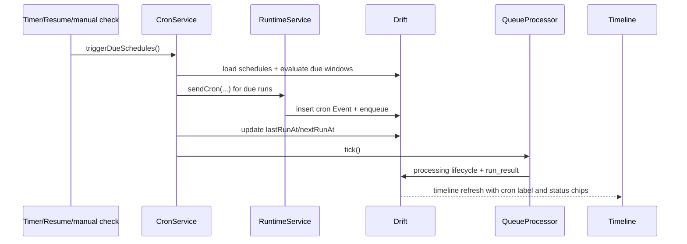
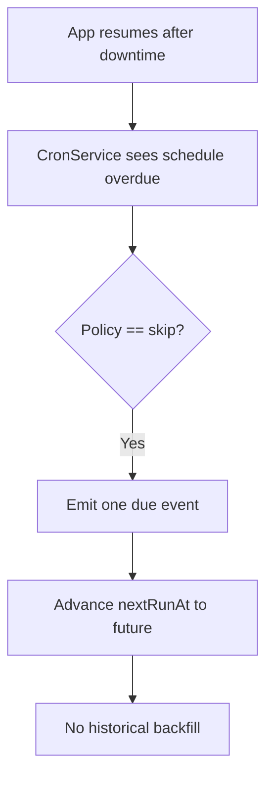
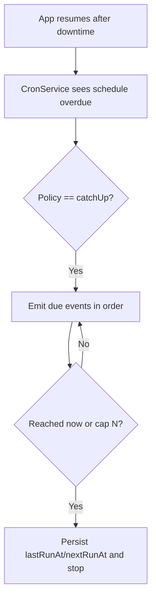
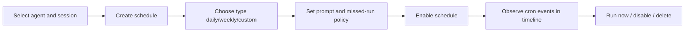

# Flutter OpenClaw Mobile Milestone 7 Cron jobs

## Scope

Milestone 7 adds **Input type 3: cron jobs** while reusing the existing runtime pipeline:
CronService -> RuntimeService/GatewayRouter -> durable queue -> processing -> timeline.

## Data model and persistence

- Added `CronSchedule` and `CronScheduleRule` domain entities.
- Supported v1 schedule subset:
  - `daily` (time-of-day minute)
  - `weekly` (weekday + time-of-day minute)
  - `custom` (`everyNMinutes` interval subset)
- Persisted fields:
  - `scheduleId`, `agentId`, `channelId`, `sessionId`
  - `enabled`, `rule`, `timezoneId`
  - `missedRunPolicy` (`skip` or `catchUp`)
  - `promptTemplate`, `lastRunAt`, `nextRunAt`
- Timezone decision in v1: **local device timezone only** (`timezoneId=local-device`).
- Drift schema migration note: `cron_schedules` table is created in app init and survives restarts.

## Scheduler behavior

- `CronService` evaluates due schedules with injected `Clock`.
- Cron events are generated as `EventType.cron` and sent through `RuntimeService.sendCron(...)`.
- Idempotency key strategy: `cron-<scheduleId>-<bucketMinute>`.
- Schedule state (`lastRunAt`/`nextRunAt`) is persisted after each due emission.
- Queue processing is auto-kicked when cron events are generated.

### Missed-run policy

- `skip`: emit only one due run when app resumes; do not backfill all missed windows.
- `catchUp`: backfills missed runs with cap.
- Current cap: **3** by default in service (tests validate capped catch-up behavior).

## Mermaid diagrams

### A) Due evaluation to UI

### B) Missed-run SKIP flow

### C) Missed-run CATCH_UP flow

### D) UX schedule flow

## Implemented vs designed

Implemented:

- Daily, weekly, and deterministic custom interval schedules.
- Persisted schedule state with robust restart behavior.
- Missed-run skip and capped catch-up behavior.
- Cron timeline labeling and queue lifecycle chips.

Deviations:

- Full cron expression parser is deferred; v1 custom subset is `everyNMinutes` only.
- Timezone is local-device only for this phase to avoid dependency and parsing complexity.

## Manual Android validation plan

1. Create/select agent and session.
2. Add three schedules (daily, weekly, custom).
3. Trigger scheduler check (manual action) and verify due events appear as cron entries.
4. Disable and re-enable schedules; confirm behavior changes accordingly.
5. Simulate missed windows by pausing app and resuming later (or debug clock in tests).
6. Verify `skip` emits one due event; verify `catchUp` emits up to cap.
7. Kill app and relaunch; confirm schedules and next run state persist.
8. Verify queued -> processing -> completed/failed chips for cron events in timeline.
