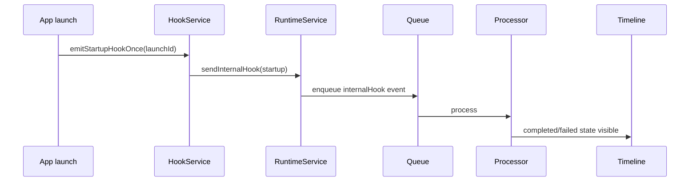
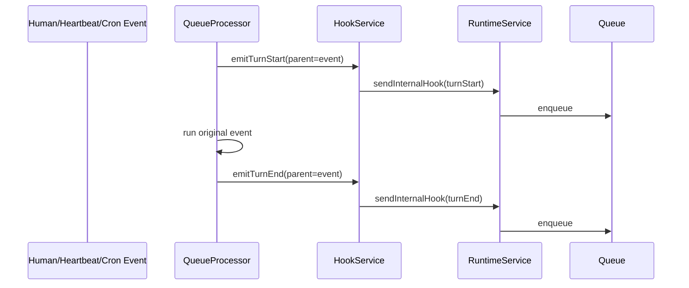
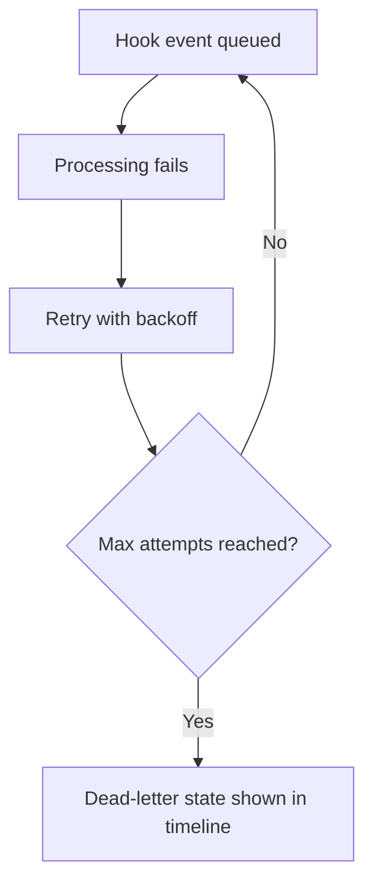
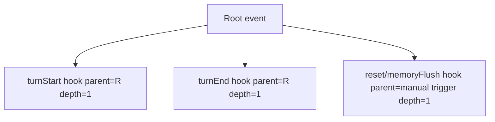

# Flutter OpenClaw Mobile Milestone 8 Internal hooks

## Scope

Milestone 8 adds **Input type 4: internal hooks** and routes hook events through the same runtime path:
HookService -> RuntimeService/GatewayRouter -> queue -> processor -> timeline.

## Hook model and configuration

- New hook type enum: `startup`, `turnStart`, `turnEnd`, `reset`, `memoryFlush`.
- New `EventType.internalHook` events include ancestry metadata:
  - `rootEventId`
  - `parentEventId`
  - `depth`
  - `orderKey`
- Hook config (`HookSettings`) is persisted in agent profile JSON:
  - global enabled flag
  - per-hook enabled map
  - prompt template per hook type
  - allowlist/caps (`maxDepth`, `maxHookEventsPerRoot`)

## Execution and safety

- Startup hook emits once per app launch using launch idempotency key.
- Turn hooks emit around normal event processing only (hook events do not recursively emit hooks).
- Loop protection:
  - max depth cap
  - max hook events per root cap
- Hook failures participate in standard queue retry/dead-letter states.

## Mermaid diagrams

### A) Startup hook flow

### B) Turn start and turn end flow

### C) Hook failure retry and dead-letter

### D) Ancestry model

## Implemented vs designed

Implemented:

- Startup, turnStart, turnEnd, reset, and memoryFlush hooks.
- Hook ancestry metadata persisted in event payload.
- Deterministic order key and timestamp sequencing for hook events.
- Loop prevention via root caps and max depth.

Deviations:

- Hook configuration UI is minimal in this milestone; config model exists and defaults are persisted.
- Memory flush behavior is a hook placeholder only (actual memory engine is Milestone 11).

## Manual Android validation plan

1. Launch app and verify startup hook appears before manual actions.
2. Send a human message and verify turnStart + turnEnd hooks appear with ancestry fields.
3. Force a failure event and confirm hook events still appear with queue lifecycle states.
4. Trigger reset hook action and memory flush hook action from app bar.
5. Verify retry/dead-letter visibility for failed hook events.
