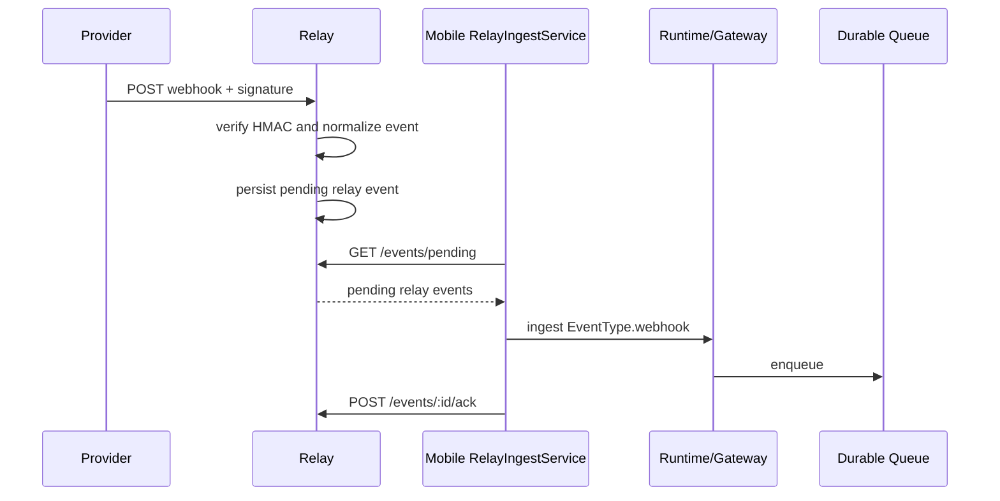
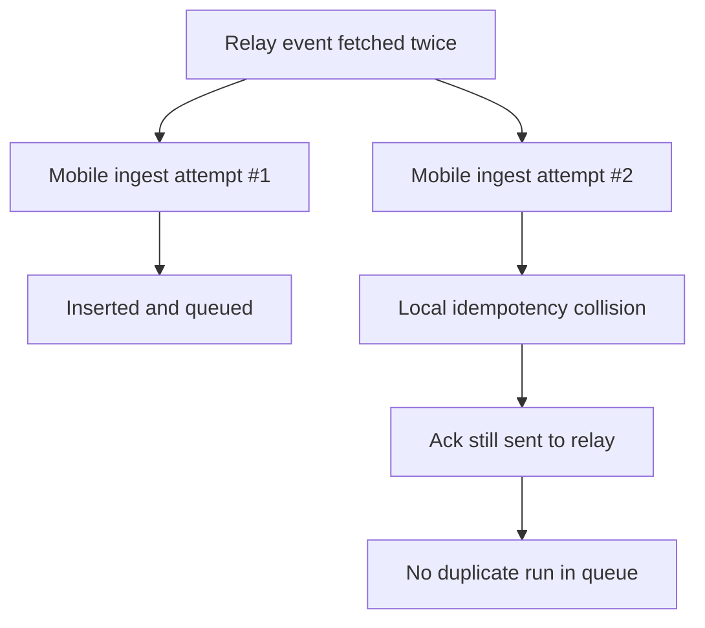
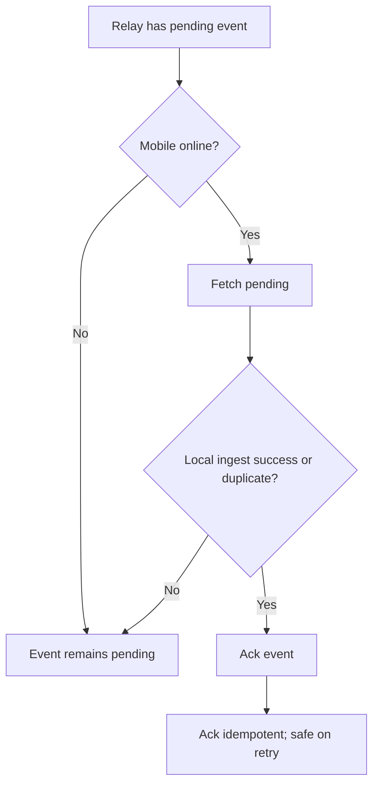

# Flutter OpenClaw Mobile Milestone 9 Webhooks

## Scope

Milestone 9 adds Input type 5 webhooks with a minimal standalone relay service plus mobile fetch and ack integration.

- Relay receives signed webhook deliveries, verifies signature, and stores canonical pending relay events.
- Mobile polls relay pending events, maps to `EventType.webhook`, ingests through existing runtime, then acks relay.

## Relay architecture overview

- Relay lives in isolated root folder: `openclaw-relay/`.
- Persistence: JSON file-backed durable store (`openclaw-relay/.data/events.json` by default).
- Incoming endpoint:
  - `POST /webhooks/generic` (HMAC SHA-256 signature verification via `x-relay-signature`)
- Mobile endpoints:
  - `GET /events/pending?since=<timestamp>&limit=<n>`
  - `POST /events/:id/ack` (idempotent)
  - `GET /health`

Canonical `RelayEvent` envelope fields persisted:

- `relayEventId`
- `receivedAt`
- `source`
- `idempotencyKey`
- `agentId`, `channelId`, `sessionId` routing hints
- `payload` (log-safe truncated)

## Signature verification and auth

- Provider webhook verification: HMAC SHA-256 shared secret (`RELAY_WEBHOOK_SECRET`).
- Mobile auth: bearer token (`RELAY_MOBILE_TOKEN`) for pending + ack endpoints.
- Invalid signatures return `401 invalid_signature`.

## Mobile fetch and ack flow

- `RelayClient` abstraction (`fetchPendingEvents`, `ackEvent`) in infrastructure layer.
- `RelayIngestService`:
  - fetch pending events
  - validate/map to existing gateway ingest (`EventType.webhook`)
  - rely on local idempotency uniqueness (`sessionId + idempotencyKey`) to suppress duplicates
  - ack relay event after local insert attempt (accepted or local duplicate)
- Delivery semantics:
  - **at least once** from relay to mobile
  - local idempotency prevents duplicate execution
  - ack idempotency prevents duplicate ack failures from causing data loss

## Mermaid diagrams

### A) Provider to relay to mobile ingest and ack

### B) Duplicate delivery and idempotency

### C) Failure handling and offline behavior

## Implemented vs designed

Implemented:

- Generic signed webhook ingest with canonical envelope.
- Pending + ack relay APIs with bearer auth.
- Mobile relay polling + ingest + ack path.
- Timeline labeling for webhook source/provider metadata.

Deviations/limitations:

- Polling is best-effort timer/resume/manual sync (no push channel yet).
- Routing uses payload/header hints with defaults in relay config.
- Persistence uses file-backed JSON store for milestone simplicity.

## Manual Android validation plan

1. Run relay locally:
   - `cd openclaw-relay && npm start`
2. Configure mobile with relay base URL/token via dart defines:
   - `--dart-define=OPENCLAW_RELAY_BASE_URL=http://<host>:8787`
   - `--dart-define=OPENCLAW_RELAY_TOKEN=dev-mobile-token`
3. Send signed webhook via curl (example with HMAC header).
4. In app, press **Sync relay now**.
5. Verify webhook event appears in timeline with provider label and queue lifecycle chips.
6. Re-send same delivery id and verify no duplicate execution in timeline.
7. Send invalid signature and confirm relay returns 401.

## Next milestone

- Milestone 10 agent-to-agent messaging: /flutter-openclaw-mobile/m10-agent-to-agent-messaging
